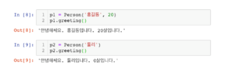
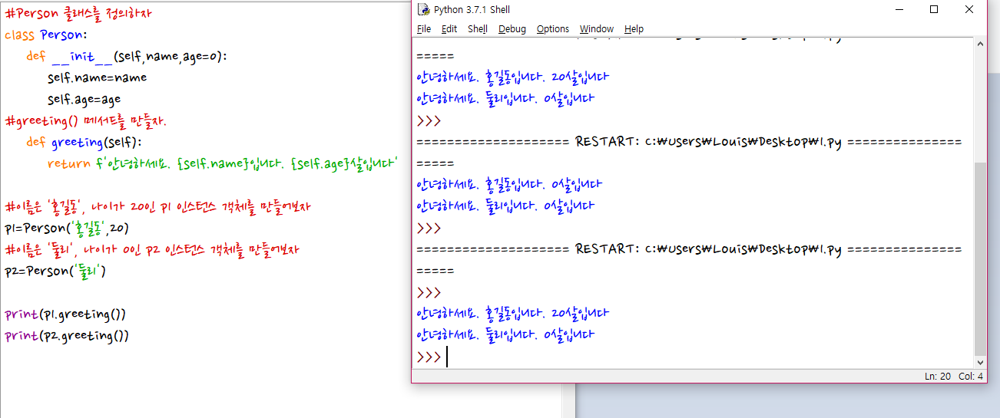

# OOP

- 학습해야 할 내용
  - 객체지향프로그래밍

1. 파이썬에서는 객체지향프로그래밍 언어입니다. 파이썬에서 기본적으로 정의된 클래스 5개만 작성해보세요.

   `str`, `int`, `list`, `complex`, `float`


2. 다음 중 틀린 것은?

   (1) 클래스 내에 정의된 멤버 함수는 '메서드(method)'라고 부른다.

   (2) 클래스는 선언과 동시에 클래스 객체가 생성되며, 인스턴스 객체를 만들면 클래스에서 선언된 메서드를 활용할 수 있다.

   (3) isinstance(인스턴스 객체, 클래스 객체)를 활용하면 상속 관계까지 확인 가능하다.

   (4) 생성자는 인스턴트 객체가 생성될 때 자동으로 호출된다. **(우리가 직접 초기화를 하고 싶을 때 생성자를 사용하고 그 생성자 메소드는 자동으로 호출된다)**

   (5) 숫자 5는 그냥 숫자일 뿐 클래스가 없다. **(X)** **<class 'int'> (int라는 클래스에서의 객체이다)** 


3. Person 클래스를 정의하고, 이름이 '홍길동', 나이가 20인 p1 인스턴스 객체를 만들어보세요. 그리고 이름이 '둘리', 나이가 0인 p2 인스턴스 객체를 만들어보세요.

   인스턴스 속성 : name, age

   메서드 : greeting()

   인스턴스 생성시 이름과 나이를 받으며, 나이가 없는 경우 0으로 설정한다.

   greeting이 호출되면, 아래와 같이 문자열을 반환한다.



```python
#Person 클래스를 정의하자
class Person:
    def __init__(self,name,age=0):
        self.name=name
        self.age=age
#greeting() 메서드를 만들자.
    def greeting(self):
        return f'안녕하세요. {self.name}입니다. {self.age}살입니다'
    
#이름은 '홍길동', 나이가 20인 p1 인스턴스 객체를 만들어보자
p1=Person('홍길동',20)
#이름은 '둘리', 나이가 0인 p2 인스턴스 객체를 만들어보자
p2=Person('둘리')

print(p1.greeting())
print(p2.greeting())
```

