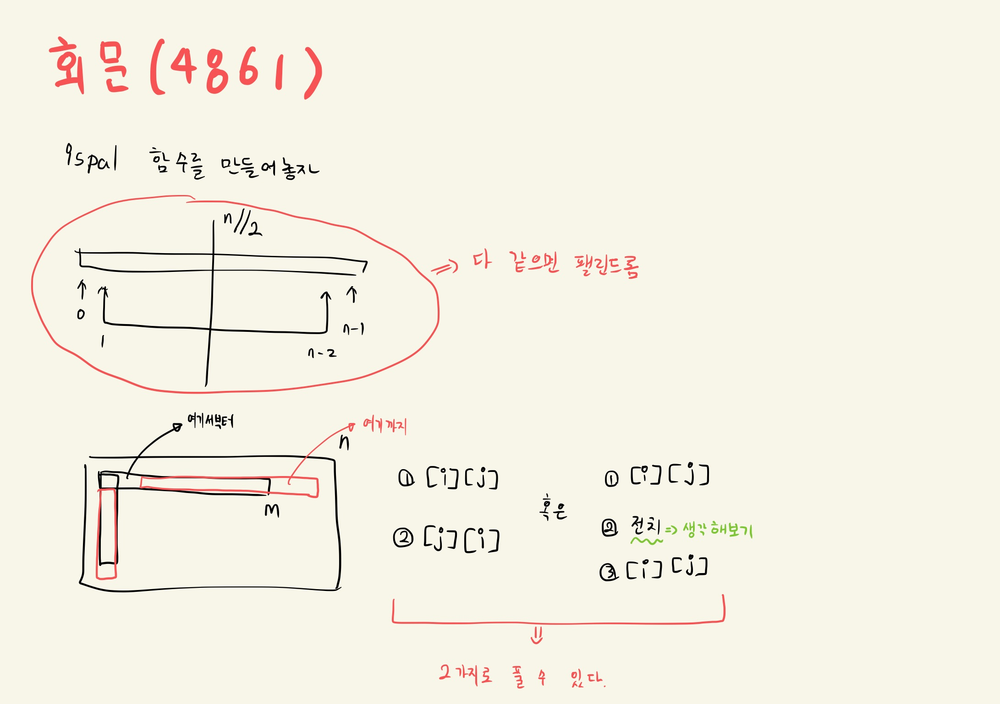
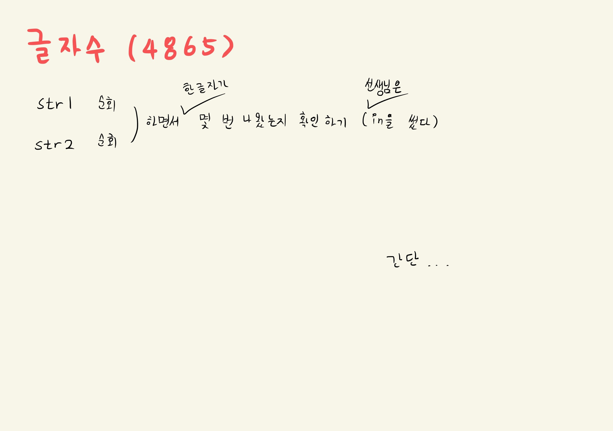
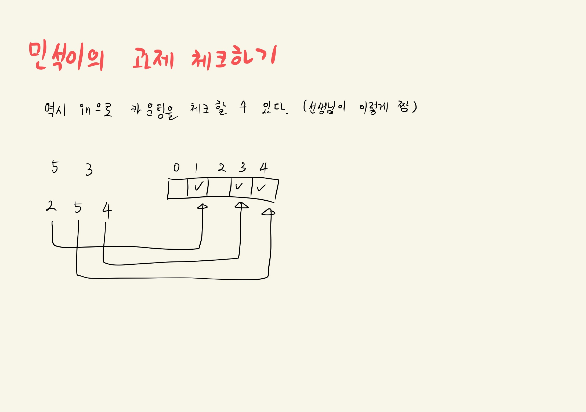
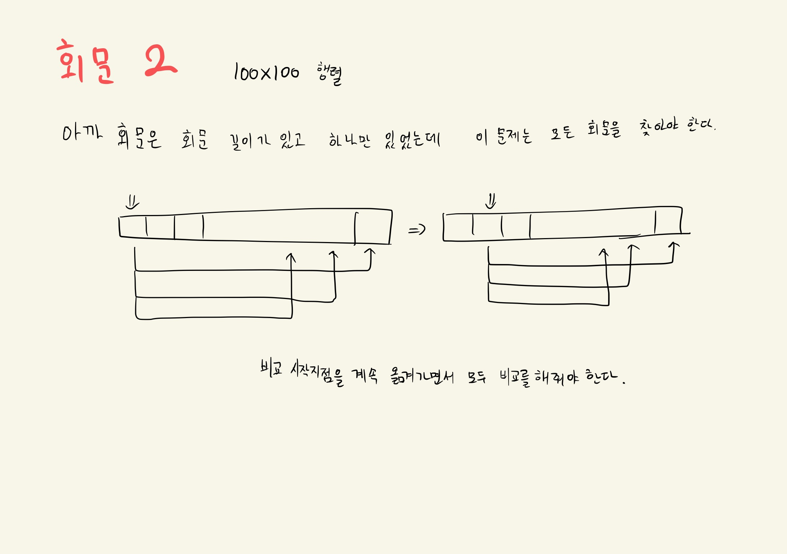

# 2019-02-13

## 알고리즘 복습(문제 리뷰)










## 스택

- 문제가 역순으로 가는 규칙이 있으면 stack으로 해결이 가능하다.

- 스택을 구현해 봅니다. 구현한 스택을 이용하여 3개의 데이터를 스택에 저장하고 다시 3번 꺼내서 출력해 봅니다.

```python
stack = [0] * 10
top = -1

for i in range(3):
    stack[top+1] = i
    top += 1

for i in range(3):
    t = stack[top]
    top -= 1
    print(t)
```

- 괄호의 짝을 검사하는 프로그램을 작성하기 (라이브러리 사용 했을 때)

```python
text='((()((((()()((()())((())))))'
#text='()()((()))'
def my_pop(lis, word):
    if lis == []:
        return 'error'
    else:
        return lis.pop()

def my_push(lis, word):
    return lis.append(word)

result=[]

for i in range(len(text)):
    if text[i] == '(':
        my_push(result, text[i])
    else:
        my_pop(result, text[i])
        
if result != []:
    print(False)
else:
    print(True)
```

- 괄호의 짝을 검사하는 프로그램을 작성하기 (라이브러리 사용 안 했을 때)

```python
stack=[0]*50
top=-1
text='()()((()))'
text=')))((())))'
a=True
def push(stack,word,top):
    stack[top]=word
    return stack

def pop(stack,word,top):
    s=stack[top]
    stack[top]=0
    return stack

for i in range(len(text)):
    if text[i]=='(':
        top+=1
        stack=push(stack,text[i],top)
    else:
        stack=pop(stack,text[i],top)
        top -=1
        if top <-1:
            a=False
if a!=False and stack == [0]*50:
    print(True)
else:
    print(a)
```

- 강사님 괄호의 짝을 검사하는 프로그램을 작성하기

```python
stack = [0] * 100
top = -1
str = "(()()))"
wrong = 0
for i in range(len(str)):
    if str[i] == '(':
        top += 1
        stack[top] = str[i]
    elif str[i] == ')':
        if top == -1:
            wrong = 1
            break
        if stack[top] == '(':
            top -= 1
if top == -1 and not wrong:
    print("correct!")
else:
    print("wrong!")
```

