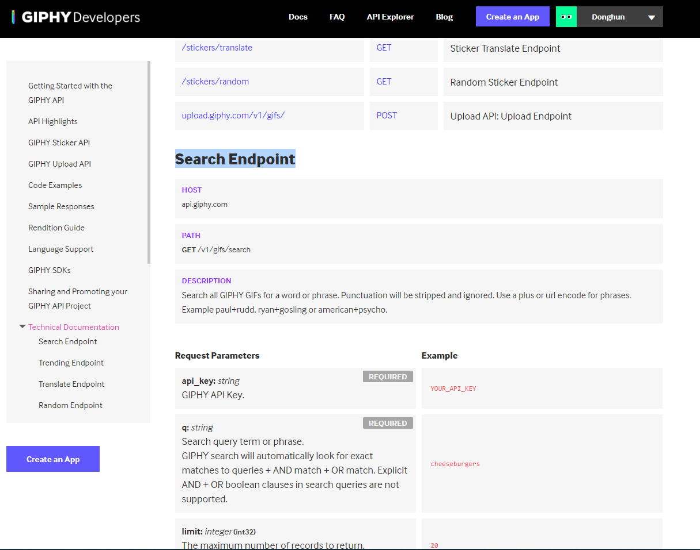
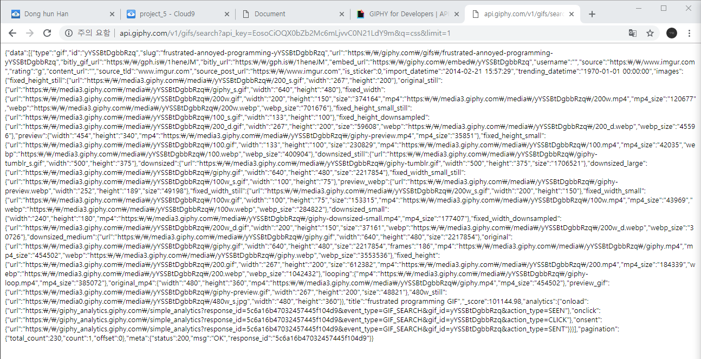

# 2019-02-18

### 여기에 관련된 필기는 Tip1~6 부분을 참고하면 된다.

## 오전

- 전생을 알 수 있는 Django 페이지를 만들어 봅시다.

- c9.io의 project_5 워크스페이스에서 BONBON이라는 폴더를 만들었습니다.

- django 설치를 위한 기본 설정을 진행합시다.

  ```shell
  $pyenv virtualenv 3.6.7 bonobn-venv
  $pyenv local bonbon-venv
  ```

- django를 설치합시다.

  ```shell
  $pip install django
  ```

- 프로젝트를 만듭시다.

  ```shell
  $django-admin startproject bonbon .
  ```

- 앱을 만듭시다.

  ```shell
  $python manage.py startapp pastlife
  ```

- Faker라는 페이크 데이터를 만들어주는 애를 써보자.

  ```shell
  $pip install faker
  $pip list
  Package         Version
  --------------- -------
  Django          2.1.7  
  Faker           1.0.2 
  ```

  ```shell
  $python #python을 실행했다.
  >>> from faker import Faker
  >>> fake = Faker()
  >>> fake.name()
  'Diane Baker' #fake 데이터를 자동으로 만들어준다.
  >>> fake.name()
  'Mike Ochoa' #fake 데이터를 자동으로 만들어준다.
  >>> fake.address() #주소도 된다.
  '3481 Bobby Crest Apt. 817\nStevenmouth, VA 35921'
  >>> fake.text()
  'Success away measure around throw suddenly. Have mouth new sense hospital short no.\nThree avoid seat answer dream write dark maybe. Discuss executive entire.' #마치 로렘입숨 같다.
  #근데 우리는 한국어를 만들고 싶어요 ㅠ..
  >>> fake = Faker('ko_KR') #인스턴스 만들 때 안에 변수로 넣으면 된다.
  >>> fake.name()
  '안지은'
  >>> fake.name()
  '서예은'
  >>> fake.address()
  '강원도 용인시 처인구 서초대92가 (예은류김동)'
  >>> exit()
  ```

- 그럼 우리가 만들고 싶은 명세를 만들도록 합시다.

  - ```
    '/'
    <h1>전생앱</h1>
    <p>전생을 알려드립니다.</p>
    <form> : 사용자의 이름을 입력받아, => /pastlife
    '/pastlife'
    XX님의 전생은 YY였습니다.
    (faker를 통해 가짜 직업을 보여준다.)
    ```

- `settings.py`를 건듭니다.

  > settings.py

  ```python
  ALLOWED_HOSTS = ['project-5-rrkkee015.c9users.io']
  
  
  # Application definition
  
  INSTALLED_APPS = [
  	...
      'pastlife',
  ]
  ```

- `views.py` / `urls.py` / `index.html`를 건들어 봅시다.

  > views.py

  ```python
  from django.shortcuts import render
  
  # Create your views here.
  def index(request):
      return render(request, 'index.html')
  ```

  > urls.py

  ```python
  from pastlife import views
  
  urlpatterns = [
      path('admin/', admin.site.urls),
      path('', views.index), #아무것도 없어야 합니다.
  ]
  ```

  > index.html

  ```html
  <body>
      <h1>전생앱</h1>
      <p>전생을 알려드립니다.</p>
      <form action='/pastlife'>
          <input type="text" name="name"/>
          <input type="submit" value="Submit"/>
      </form>
  </body>
  </html>
  ```

- `views.py`에서 `/pastlife`를 만들어 봅시다.

  - index에서 넘어온 이름을 받고 `name=request.GET.get('name')`
  - faker를 통해 가짜 전생(직업)을 생성하여`from faker import Faker` / `fake=Faker('ko_KR')` / `job=fake.job()`
  - pastlife.html에 뿌려줘 봅시다. `{'name':name,'job':jon}`

  > views.py

  ```python
  from django.shortcuts import render
  from faker import Faker
  
  # Create your views here.
  def index(request):
      return render(request, 'index.html')
      
  def pastlife(request):
      #1. index에서 넘어온 이름을 받고,
      #2. faker를 통해 가짜 전생(직업)을 생성하여
      #3. pastlife.html에 뿌려줍시다.
      name = request.GET.get('name')
      fake=Faker('ko_KR')
      job=fake.job()
      # context = {
      #    'name':name,
      #    'job':job
      #}
      return render(request, 'pastlife.html', {'name':name,'job':job})
  	#return render(request, 'pastlife.html', context)
  ```

- 근데 매번 다른 값이 나오는 것보단, 같은 것이 반복적으로 나오게 한다면 더욱 신뢰성이 높을 것이다.

  - 만약 해당 이름이 DB에 저장되어 있다면, DB에 저장된 값을 출력해준다.
  - 없다면 faker를 통해 fake job을 만들어서 DB에 추가하고 해당 값을 job에 저장한다.

- 테이블의 정의를 먼저 해봅시다.

  > models.py

  ```python
  from django.db import models
  
  # Create your models here.
  
  class Job(models.Model):
      name=models.TextField()
      job=models.TextField()
  ```

- 정의를 했으니 `migration` 절차를 진행합시다. (DB를 만드는 것)

  > workspace

  ```shell
  $python manage.py makemigrations
  $python manage.py migrate
  $python manage.py shell
  ```

- 이제 models.py를 import해서 DB를 조작할 것입니다.

  > shell

  ```shell
  >>> from pastlife.models import Job
  ```

- 선생님을 셔터맨으로 만들어 봅시다.

  > shell

  ```shell
  >>> a=Job(name='강동주',job='셔터맨')
  >>> a.save() #이 방법도 있지만 아래 방법도 간단하게 만들 수 있다.
  >>> Job.objects.create(name='한동훈',job='아이돌')
  >>> Job.objects.all()
  <QuerySet [<Job: Job object (1)>, <Job: Job object (2)>]>
  >>> Job.objects.first().name
  '강동주'
  >>> Job.objects.first().job
  '셔터맨'
  >>> Job.objects.all()[1].name
  '한동훈'
  >>> Job.objects.all()[1].job
  '아이돌' #이렇게 계속 이어 붙히는 것이 메소드 체이닝이라고 한다.
  >>> Job.objects.all()
  <QuerySet [<Job: Job object (1)>, <Job: Job object (2)>]> #이런 애들은 repr이 불린 것이고 바로 그 결과를 볼 수 있게 만들어 주고 싶다. 아래의 models.py를 손 보면 된다.
  ```

  > models.py

  ```python
  from django.db import models
  
  # Create your models here.
  
  class Job(models.Model):
      name=models.TextField()
      job=models.TextField()
      
      def __repr__(self):
          return f"{self.name} : {self.job}"
  ```

- 여기까지 되면 새롭게 정의된 `models.py`을 가져와야 한다.

  > shell

  ```shell
  >>> exit()
  $python manage.py shell
  >>> from pastlife.models import Job
  >>> Job.objects.all()
  <QuerySet [강동주 : 셔터맨, 한동훈 : 아이돌]>
  >>> print(Job.objects.first())
  Job object (1)
  #얘도 어떻게 바꿔보고 싶은데? str 메소드를 오버라이딩 하면 된다.
  ```

  > models.py

  ```python
  from django.db import models
  
  # Create your models here.
  
  class Job(models.Model):
      name=models.TextField()
      job=models.TextField()
      
      def __repr__(self):
          return f"{self.name} : {self.job}"
          
      def __str__(self):
          return f"<{self.name} : {self.job}>"
  ```

- 또, 수정을 했으니 다시 `models.py`를 가져와야 한다.

  > shell

  ```shell
  >>> exit()
  $python manage.py shell
  >>> from pastlife.models import Job
  >>> print(Job.obejects.first())
  <강동주 : 셔터맨>
  ```

- 자, DB도 만들었으니 다시 `views.py`에서 사용을 하면 된다. 근데 역시 얘도 `import`를 해줘야 알아 듣는다.

  > views.py

  ```python
  from .models import Job #같은 위치에 있으니 .
  ...
  ...
  def pastlife(request):
      name = request.GET.get('name')
      fake=Faker('ko_KR')
      job=fake.job()
      #DB에서 해당이름의 레코드가 있는지 찾아본다.
      person = Job.objects.filter(name=name).first()
      #person = Job.objects.get(name=name) #위에 애랑 같다.
      
      if person: #None은 False이다. DB 안에 입력한 값이 있다면 True문 실행
         job=person.job
      else: #DB 안에 입력한 값이 없다면 False문을 실행
          #faker를 통해 fake.job을 만들고 새로운 데이터를 만들자
         	new_person=Job(name=name, job=job)
        	new_person.save()
      return render(request, 'pastlife.html', {'name':name,'job':job})
  ```

- get은 만약에 DB에 없는 값이 입력된다면 에러가 뜨고, filter는 None을 출력한다.

  > shell

  ```shell
  >>> person = Job.objects.filter(name="김경태").first()
  >>> print(person)
  None
  >>> person2 = Job.objects.filter(name="한동훈").first()
  >>> print(person2)
  <한동훈: 아이돌>
  >>> person3 = Job.objects.get(name="김경태")
  Traceback (most recent call last):
    File "<console>", line 1, in <module>
  ...
  ...
  ```

- 이렇게까지 하면 한 번 입력된 값은 계속 똑같은 값이 출력이 되는 전생 어플이 완성 된다.

- 이제는 짤방도 같이 넣어주자. 사이트는 **Giphy Developers (움짤이 모아놓은 사이트)**를 사용 할 것이다. 회원가입도 하고~ 로그인을 하면~ 네이버에서 API 썼던거처럼 쓰면 된다. 새로 앱을 만들면 `Api Key`를 준다.

- 우리는 Search Endpoint를 사용할 것이다.

  

- `GET` 방식으로 전달 된다. `api.giphy.com/v1/gifs/search`를 이용

- 일단 `api_key`라는 파라미터랑 `q`파라미터를 넣어 줄 것인데 api_key는 발급받은 key를 넣어 줄 것이고 q는 우리가 검색할 단어를 넣을 것이다.

- `limit`은 갯수 딱 한 개, `lang`은 언어를 입력 받는 것인데 `ko`라고 한국어로 검색이 가능한 파라미터다.

- 이걸 이어 붙히면

  ```
  
  ```

  이런 url이 나오고 이것을 주소창에 입력하면 아래와 같이 나온다.

  

  json 형식인데 나는 json viewer가 다운이 안되어 있어서 더럽게 나온다. 여기서 `q 파라미터를`를 `job`으로 바꾸면 된다.

- 여기까지 했으니 얘한테 요청을 보내서 받아서 그것을 html에서 보여주는 코드를 짜보자

  > views.py

  ```python
  from django.shortcuts import render
  from faker import Faker
  from .models import Job
  import os
  import requests
  import json
  
  # Create your views here.
  def index(request):
      return render(request, 'index.html')
      
  def pastlife(request):
      #1. index에서 넘어온 이름을 받고,
      #2. faker를 통해 가짜 전생(직업)을 생성하여
      #3. pastlife.html에 뿌려줍시다.
      
      giphy=os.getenv('giphy')
      name = request.GET.get('name')
      fake=Faker('ko_KR')
      job=fake.job()
      # context = {
      #    'name':name,
      #    'job':job
      #}
      person = Job.objects.filter(name=name).first()
      
      if person: #None은 False이다. DB 안에 입력한 값이 있다면 True문 실행
         job=person.job
      
      else: #DB 안에 입력한 값이 없다면 False문을 실행
          #faker를 통해 fake.job을 만들고 새로운 데이터를 만들자
          new_person=Job(name=name, job=job)
          new_person.save()
      url=f'https://api.giphy.com/v1/gifs/search?api_key={giphy}&q={job}&lang=ko&limit=1'
      res=requests.get(url)
      res_j=res.json()
      result=res_j['data'][0]['images']['original']['url']
      return render(request, 'pastlife.html', {'name':name,'job':job,'result':result})
  ```

  > pastlife.html

  ```html
  <body>
      <h1>{{name}}님의 전생은 {{job}}였습니다.</h1>
      
  </body>
  ```


## 오후

- 게시판을 만들어보자 / 앱 하나를 새로 만들어보쟈

  > shell

  ```shell
  $python manage.py startapp articles
  ```

  > settings.py

  ```python
  INSTALLED_APPS = [
  	...
      ...
      'pastlife',
      'articles',
  ]
  ```

- `/articles`를 가면 모든 글들을 보여주는 곳 (제목만)

  - `/articles/1` 글 상세페이지

  - `/articles/new` 새 글을 작성

  - `/articles/create` 새 글을 저장 (실제 `html`페이지가 필요없다.)

  - `/articles/1/edit` 글을 편집

  - `/articles/1/update` 글을 수정

  - `/articles/1/delete` 글을 삭제

    - aritcles가 반복되니까 새로운 `urls.py`를 만들어서 이 반복을 없애보자

    - 대장 문지기에게는 `inclued`를 사용해서 서브 `aritcles`가 들어온다면 문지기에게 보내줘야한다.

      > bonbon/urls.py

      ```python
      urlpatterns=[
          ...
          ...
          path('articles',include('articles.urls'))
      ]
      ```

      > articles/urls.py

      ```python
      from django.urls import path #얘는 복사해와야함
      from . import views
      
      urlpatterns = [
      	path('',views.index)
      ]
      ```

      > articles/views.py

      ```python
      def index(request):
          return render(request, 'index.html')
      ```

- 이렇게 하다보면 이름이 다 똑같아지는 순간이 있는데, `pastlife` 폴더 안에 templates 안에 또 `pastlife`라는 앱과 같은 이름의 폴더를 만들 것인데, 그럴 땐 아래와 같이 `html` 파일 호출을 해야한다. 이렇게 안하면 충돌이 생긴다.

  > pastlife/views.py

  ```python
  # Create your views here.
  def index(request):
      return render(request, 'pastlife/index.html')
  ```

- 장고는 urls.py에서 url마다 별명을 지어줄 수 있다.

  > urls.py

  ```python
  from django.urls import path #얘는 복사해와야함
  from . import views
  
  urlpatterns = [
  	path('',views.index, name='index'),
  	path('new/',views.new, name='new'),
  	path('create/',views.create, name='create'),
  	path('<int:num>/',views.detail, name='detail'), #이렇게 별명을 하나씩 지어줄 수 있다.
  ]
  ```

  > views.py

  ```python
  def delete(request, num):
      D_article=Article.objects.get(pk=num)
      D_article.delete()
      return redirect(f'index') #이렇게 별명으로 redirect를 할 수 있다.
  	#return redirect('/articles/')랑 똑같다.
  ```

- 근데 또 ! 이렇게 하면 다른 앱들과 충돌이 일어날 수 있으니 사전에 처리가 필요하다.

  > urls.py

  ```python
  from django.urls import path #얘는 복사해와야함
  from . import views
  
  app_name='articles'
  
  urlpatterns = [
  	path('',views.index, name='index'),
  	path('new/',views.new, name='new'),
  	path('create/',views.create, name='create'),
  	path('<int:num>/',views.detail, name='detail'), #이렇게 별명을 하나씩 지어줄 수 있다.
  ]
  ```

  > views.py

  ```python
  def delete(request, num):
      D_article=Article.objects.get(pk=num)
      D_article.delete()
      return redirect('articles:index')
  ```

- 만약 id를 넘기고 싶으면 어떻게 하면 되나요?

  > views.py

  ```python
  def delete(request, num): #예제라서 얘를 썼지 원래라면 삭제한 놈의 아이디는 존재할 수 없다.
      D_article=Article.objects.get(pk=num)
      D_article.delete()
      return redirect('articles:detail', num)
  ```

- 이 별명은 html과 같은 템플릿에도 넣어줄 수 있다.

  > detail.html

  ```html
  <h1>{{title}}</h1>
  <p>{{content}}</p>
  ...
  ...
  <a href="">게시판</a>
  ```

### 앞으로의 장고 사용에선 모두 이렇게 별명을 사용할 것이다 !

그리고 한동훈은 멋쟁이다!

AWESOME!


