## 2018-12-19

- **나만의 웹 페이지 만들기**

1. google에다가 free bootstrap template 치면은 대단히 많이 나온다 템플릿이, 그 중 마음에 드는 하나를 다운 받자. 

2. github에 그 파일들을 올려야 하니까 day3에 github_page라는 폴더 안에 넣도록 하자 폴더 만드는 건 git bash를 이용해서 만들도록 하자

3. 단, new repository를 만들 때 rrkkee015.github.io의 이름으로 만들자

4. download를 잘 하고 git hub에 잘 올렸으면 rrkkee015.github.io를 주소창에 치면 나만의 웹페이지가 뿅하고 뜬다.

5. settings에 들어가서 밑에 github pages가 있는데 custom domain을 쓰고 싶으면 여기서 쓸 수 있다.


- **웹 페이지 프로필 사진 변경하기**

1. github_page에서 index 파일을 visual studio로 열자
2. title은 크롬 주소창 위의 상단 이름을 변경시켜준다.


3. 본인이 찾고자 하는 부분의 위치가 궁금하면 F12에서 마우스로 클릭하면 주소창 찾아주는 애로 찾으면 된다.

   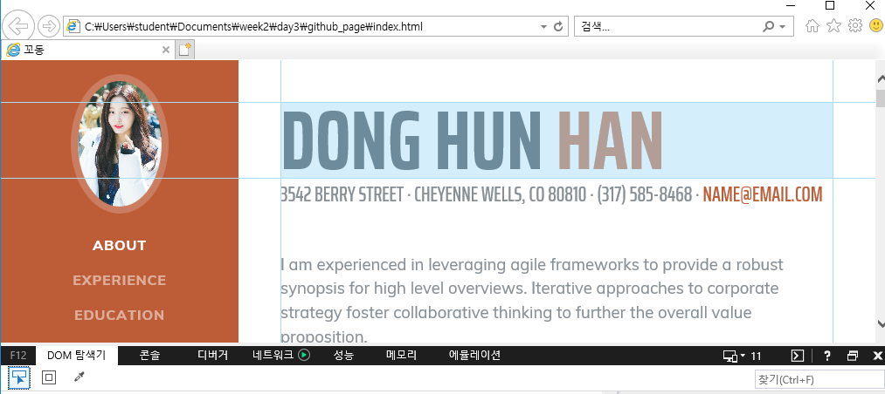

4. 프로필 사진은 img 부분에서 src를 바꿔주면 되고 (주소 링크로), Clarence taylor 색깔이 다르니 두 개 속성이 다르다. 이걸 파악해서 두 개 바꿔주면 된다.

   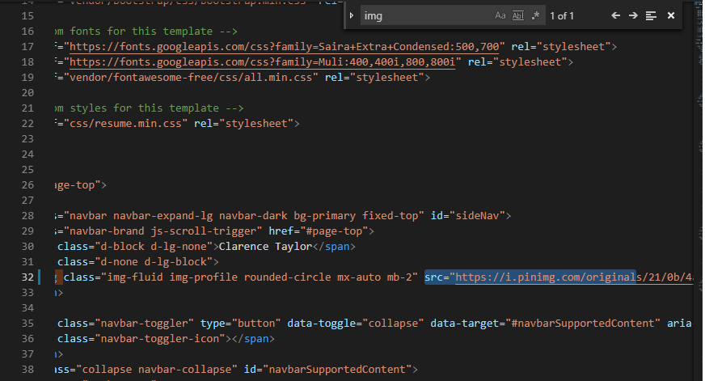

5. 각종 브랜드 마크는 **fontawesome**에서 사용하면 된다. 거기서 밑에 스크린샷에 있는 부분 복사해서 원하는 위치에 붙여넣기 하면된다.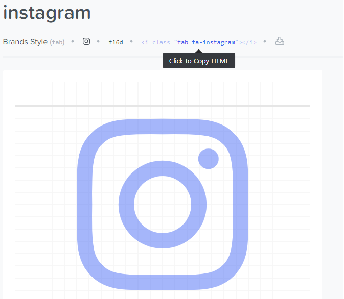

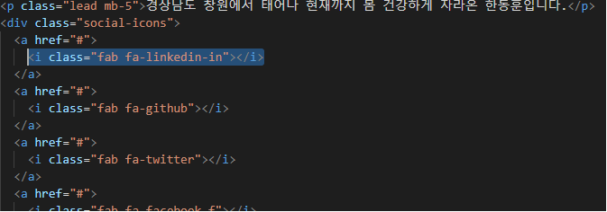

​	(위에 카피한 애를 밑에 드래그 한 애로 붙여넣기 하면 된다)


- **C9** (지금 이 컴퓨터는 리눅스 체제가 아니니까 간단하게 리눅스 체제 컴퓨터 한대를 임대하는 개념이다)

1. 주소창에 c9.io 치면 AWS Cloud9 나오는데 거기서 기존 c9.io 고객용 로그인을 눌러야한다.

2. new workspace를 만들고 workspace name에 이름 적고 Public 하고 blank로 템플릿 두고 create

   (아 참고로 그 이메일에 초대장을 받았기 때문에 만들 수 있었던거 같다)

3. 얘 자체로도 파이썬이 있는데 버전이 낮다 그래서 파이썬 넣구 플라스크 넣구 할거다.


4. https://github.com/sspy2/install_python 홈페이지로 들어가보자. 여기서 명령어를 붙혀넣으면 다운 받을 필요 없이 내부에서 업데이트가 된다. 이렇게


5. 이렇게 하고 환경변수를 한 줄씩 복수 해준다. vi ~/.bashrc 이걸 하면 환경 변수를 자세히 볼 수 있다. 하고나서 나올 땐 esc 연타 하고 :q를 하면 나올 수 있다. source ~/.bashrc로 실제로 source화 시켜주는 애로 마무리. 마지막 reset을 한번 clear해주자

6. 위에걸 했으면 python enviorment가 설치 되었다. pyenv 가 진짜 python이 아니다. pyenv 설치를 도와주는 애이다. 따라서 pyenv install 3.6.7하면 python 설치 중

7. 이 파란 창을 터미널이라고 한다. 그리고 이 기본은 리눅스라서 git bash랑 똑같이 적용된다.

   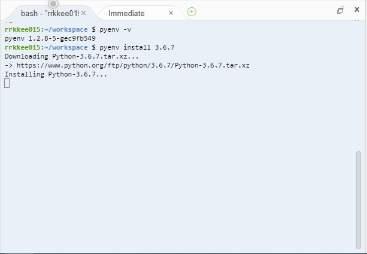

   

8. 근데 여기까지 하고 파이썬 버전 확인했는데도 3.6.7이다. pyenv global 3.6.7을 해줘야한다. 이렇게 하면 파이썬 버전이 바뀌어져 있다.
9. 그 동안 챗봇에서는 다 다운이 다 되어있었기 때문에 beautifulsoup를 쓸 수 있었지만 여기선 직접 다운을 해주어야한다.  pip install bs4를 해주자. pip install requests도 해주자 오후엔 Flask (경량화 웹 프레임 워크)를 만들어 볼거다. 그래서 pip install flask를 해주자
10. 새로운 환경에 있으니까 제대로 돌아가는지 복사해서 붙여넣기를 해보자 touch app1. py를 만들고 챗봇에서 기존에 만든 코드를 만든 app1.py에다가 붙여넣기하자 그리고 터미널에서 python 실행할 땐 python app1.py를 하면된다. (위에 Run 버튼은 안쓰니까 볼 필요 없다.)


11. 얍얍얍


- **Flask** : BeautifulSoup, requests 처럼 기능 뭉탱이 중에 하나이다. **파이썬으로 쓰여진** 경량화 웹 프레임 워크이다. 데이타 베이스도 없고, 많은 것들이 없다.

1. c9에서 app2.py 만들고 열어보자. 근데 이름 바꿔야함 터미널에서 **mv app2.py app.py** 하면 이름이 바뀐다.(app2->app)

```python
from flask import Flask

app = Flask(__name__)

@app.route('/index')
def index():
    print("hi")
    return"꼬동"
```

```
flask run --host 0.0.0.0 --port 8080
```

**여기서 서버 돌리고 있는 상황에서 진행을 해야한다. 터미널에 밑에 거 치고 건들면 안된다.**

밑에 거 실행하면 주소 하나 뜨는데 그거 오픈해서 들어가서 주소 맨 마지막에 /index를 붙여넣으면 흰 바탕의 웹이 뜰거다.

2.  http://week2-rrkkee015.c9users.io:8080/index 이 주소가 만들어 졌다. 남들이 여기 들어오면 내꺼 훔쳐볼 수 있다.

3. python에서 원하는 것을 수정하고 서버를 껐다가 다시 저 위에거를 삽입하고 링크 타고 들어가면 수정한 값이 뿅 나온다.

4. 근데 이거 서버 껐다 키는거 좀 번거롭지 않니? 그걸 해결하도록 하자 https://github.com/sspy2/install_python 여기서 flask setting에 있는

   ```
   echo 'export FLASK_ENV=development' >> ~/.bashrc 
   ```

   이것을 터미널에 입력하자 엔터 하면 갈기고 source ~/.bashrc 하면? 끝 !

5. 이렇게 하면 Warning 메세지가 안나온다. debugger가 active가 된다. 그러면 수정하면 터미널에서 변경을 알아서 그 웹 페이지에서 새로고침하면 뿅 하면 터미널에서 수정된 결과값이 또 뿅 뜸

6. 그렇다면 그 웹페이지에서 페이지 소스를 보도록 하자, 우클릭하고 페이지 소스보기 ㄱㄱ 보니까 문자열을 받은게 끝이다. 근데 그 문자를 h1 tags로 감싸면 웹페이지 문자열이 바뀐다. (커진다)

   (즉, 파이썬에서 적은 정보를 웹페이지에서 표현이 가능하다.)

7. 챗봇에 네이버 웹툰 크롤링한거 가져와서

   ```
   def naver_toon(): #이 밑에다가 다 복사하도록 하자. 아마 들여쓰기가 제대로 안되있을거다. 맞춰주자.
   #대신 import한거는 제일 위에 올려놓아야한다.
   #그리고 제일 밑 print(toons)를 return"{}".format(toons)로 바꿔야한다.
   ```

   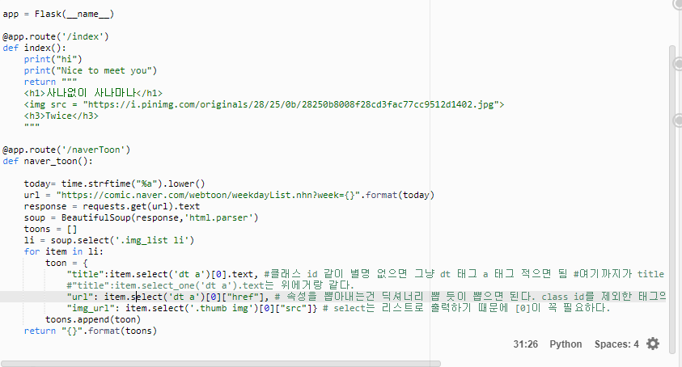

8. return에서 html 파일을 분리 할거다. 그러기 위해선 from flask import Flask에 render_template(맞춰진 틀에다가 끼워 넣는다는 뜻)을 추가 해야한다. 그 후 밑에 작성

   ```
   return render_template('naver_toon.html')
   ```

   이렇게 하면 naver_toon.html 파일이 있어야하는데 그 파일은 app.py가 있는 폴더가 아닌 한 단계 밑에 폴더에 있어야한다.

   ```
   rrkkee015:~/workspace/day3 $ mkdir templates
   rrkkee015:~/workspace/day3 $ touch templates/naver_toon.html
   ```

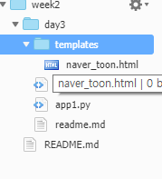

9. 만든 파일 안에 밑에 코드 쩌럼 짠다. h1이니까 글씨가 커지겠지? 그리고 html을 치면 그 밑에 자동으로 html snippet이 뜨는데 구조를 자동으로 만들어준다. 또, body 위에 head 있다고 생각하면 된다.


10.  그런 후 flask를 실행하면 이렇게 대문 짝만하게 뜬다. 따란~


11. toons라는 배열에 여러가지 만화가 들어가 있는 상태인데 naver_toon.html에 하나씩 뽑아서 출력을 해야한다. 근데 html 파일에서 python 코드를 실행 할 수 없다. 그러면 우째야 할까?

```
2가지 방법이 있다. 눈에 보이는 것과 보이지 않는 것
눈에 보이는 건 출력물이 보여야 겠죠? 보이지 않는 건 반복문, 변수 선언이겠죠?
html 에서는 무조건 {} 써야한다.

1. 눈에 보이는 것 (결과값)
{{ toons }} 근데 toons는 싫어 t가 좋으면 python 파일에서 toons = t로 하고 넘기도록 하자 {{ t }}

원래라면
return render_template('naver_toon.html') 얘를
return render_template('naver_toon.html',t = toons) 이렇게 수정했다.

그리고 5번 반복하고 싶으면? 

2. 눈에 보이지 않는 것
를 {{t}} 위에 적고 하면 에러 뜬다. 그럼 에러 뜨는데 문법 에러 떴네? for문을 돌렸는데 어디가 끝인줄 모르겠데 근데 나도 왜 그런지 몰라. 구글링 ㄱ
알아보니까 를 안썼다.
```

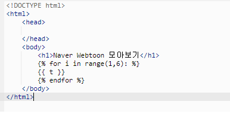

12.  toons 내용을 썸네일 웹툰제목 웹툰링크로 나눠서 출력을 해보자. t를 생짜로 뽑아보니까 title, img url, url을 key를 가지고 있다. 그 키에 맞게 img tag에 넣어주고 herf tag에 넣어주고 하면 그림도 나오고 한다.

    **내가 짠 코드**

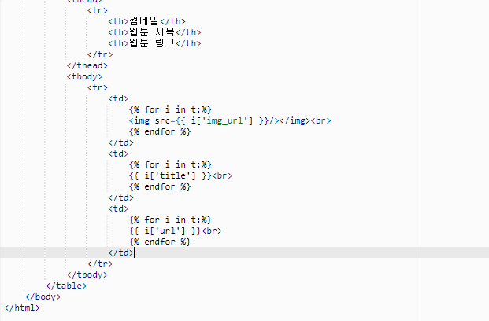

​	하지만 이미지에서 막혔다 ㅠㅠ

​	**쌤이 짠 코드**

​	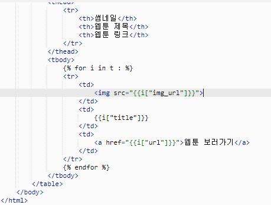

​	**결과**

​	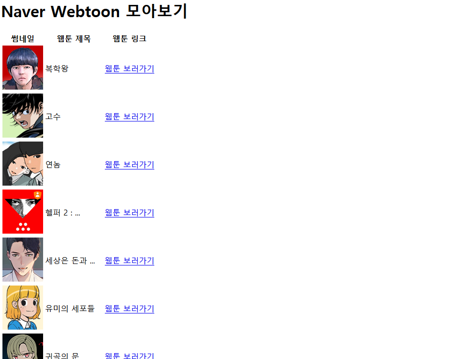

- **앞으로 할 것**

  우리 컴퓨터, 서버 컴퓨터 사이를 전달하고 전달 받았는데 그 중간에 챗봇이 들어가면서 우리 휴대폰에서도 그 정보 오고 가는 것을 볼 수 있다. 근데 우리가 실력이 좀 늘었으니 챗봇 말고 Cloud 9 서비스를 적용해보자 (왜 c9? => 지금 멀캠 컴퓨터는 윈도우라서 불편하니까 c9의 Linux를 쓰는거임)

  그런데? c9 얘도 서버 컴퓨터 역할을 할 수 있다. 챗봇이면 나만 볼 수 있는데 c9을 쓰면 너도  나도 볼 수 있다.그래서 c9을 쓰는거임

  관심있는 부동산 거래내역 정보를 검색할 수 있는 사이트를 만들어 볼 것이다. 그리고 다음 웹툰, 네이버 웹툰 만들었던 것을 실제로 표로 만들어 볼 거다. 예를 들어 타이틀, 썸네일, 링크를 한 눈에 볼 수 있도록 만드는 것이 목표이다. 그리고 c9 서버와 telegram을 연결시킬거다. 한 시간에 한 번 씩 사람인에서 변하는 취업 정보를 telegram으로 알려주는 서비스를 만들어 볼 것이다.

  우리 폰에서 telegram으로 보내면 c9 컴퓨터로 메세지를 전달해주고 c9에서 그 것을 대신 처리하고 다른 곳에 요청을 보내고 그 메세지를 받고 telegram으로 보내고 다시 telegram이 우리폰한테 준다.