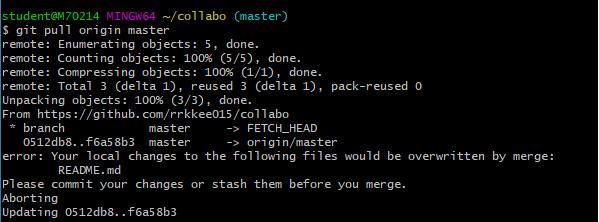
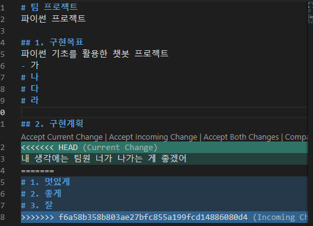
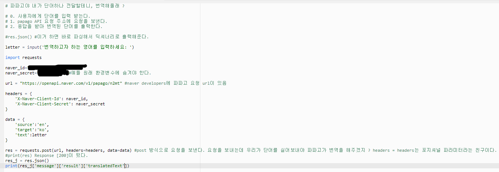
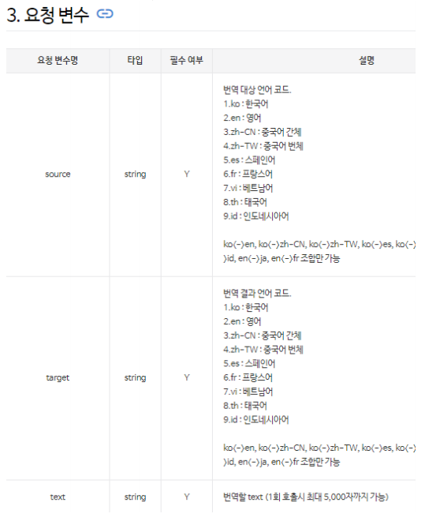
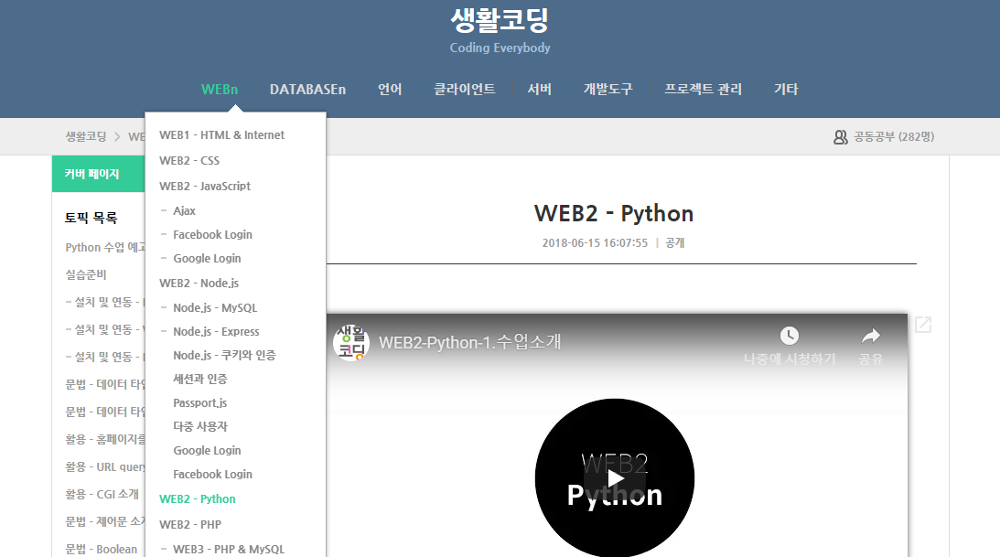

# Week4 - Day 4

- python에서 webbrowser를 다룰 수 있다.

```python
import webbrowser

webbrowser.open("https://www.daum.net") #파이썬에서 한번에 변수 url을 열어주는 코드

# 모모랜드 모든 멤버들의 검색 페이지를 한 번에 여는 코드

webbrowser.open("https://search.daum.net/search?nil_suggest=btn&w=tot&DA=SBC&q=%EB%AA%A8%EB%AA%A8%EB%9E%9C%EB%93%9C+%EC%97%B0%EC%9A%B0") #모모랜드 연우 검색결과
webbrowser.open("https://search.daum.net/search?nil_suggest=sugsch&w=tot&DA=GIQ&sq=%EB%AA%A8%EB%AA%A8%EB%9E%9C%EB%93%9C+%EB%82%B8%EC%8B%9C&o=1&sugo=15&q=%EB%AA%A8%EB%AA%A8%EB%9E%9C%EB%93%9C+%EB%82%B8%EC%8B%9C") #모모랜드 낸시 검색결과
```

위 코드는 너무 무식해

```python
import webbrowser

webbrowser.open(url)

#webbrowser.open("https://search.daum.net/search?q=검색어") #다음 기존 검색 url #주소창을 변경시키는 행위이다.
url = "https://search.daum.net/search?q=" + "연우"
```

근데 우리 input 배웠잖아

``` python
import webbrowser

keyword = "연우"
url = "https://search.daum.net/search?q="

webbrowser.open(url + keyword)
```

이러면 키워드 맨날 바꿔야 함. input 넣자

```python
import webbrowser

keyword = input("검색어를 입력해주세요: ")
url = "https://search.daum.net/search?q="

webbrowser.open(url + keyword)
```

모모랜드 모든 멤버들의 검색 페이지를 한 번에 여는 코드를 만들어보쟈, **반복문을 사용.** 반복되는 건 무조건 줄이는 것이 컴퓨터 프로그래밍의 기본이다 !

```python
import webbrowser

url = "https://search.daum.net/search?q="

momo = ["나윤","혜빈","낸시","연우","아인","주이","제인","데이지","태하"]
# momo라고 하는 리스트를 한 번씩 돌면서, 웹 브라우저를 연다.
for keyword in momo:
    webbrowser.open(url + keyword)
```

------

### 앞서 짠 파이썬 파일을 github에 올리는 법

1. gitbash에서 git init을 한다. (git init 위치는 git_practice 폴더 내부이다)


2. git add .browser.py (위에 짠 파일을 browser.py라고 만들었었다)

3. git commit -m "아무거나"

4. 새로 만든 레포지토리에서 주소 복사해서 넣자

5. git push하자

- **여기까지는 동일하다.**

### *이제 나는 이 깃 파일을 집에서도 관리를 하고 싶어 어떻게할까?*

**내 노트북이라고 가정**

1. clone or download를 해야한다. 그 주소를 home computer의 gitbash에서 git clone 하고 주소를 붙여넣으면 된다. (git clone https://www.github.com/rrkkee015/blahblah)
2. sublime text를 다운받아 실행한다. (집에서 쓰는 에디터라는 가정)
3. folder을 오픈한다. github에 올린 git_practice 그 폴더를 올린다.
4. 수정하고 싶은건 수정하자.
5. 그리고 수정한 폴더를 git add ./git commit -m "아무거나"/git push를 하면 수정 뿅
   - git push할 때 주의할 것은 git을 어디서 가져왔는지 이미 정보를 가지고 있기 때문에 따로 주소를 알려줄 필요가 없다. (remote add origin 얘)

**이제 다시 싸피 컴퓨터로 왔다**

1. 수정된 파일을 git으로 부터 받아야 한다. (그럴 땐 git pull을 사용 !)
2. gitbash에서 git_practice 폴더를 들어가서 (git init한 폴더에서) git pull을 하면 된다. 수정이 완료된다.


### 이거 할 땐 진짜 조심해야하는 건 !! 수정을 했으면 어느 컴퓨터에서든 작업시작 전에 git pull을 제일 먼저하고 수정을 해야한다 !!

-----

- ### 이제 github로 공동 프로젝트를 만들어보자

  *팀장이 할 일*

1. 폴더 하나를 새로 만든다. (mkdir collabo) => (cd collabo) => (code .)로 vs를 연다.

2. 거기서 파일 README.md을 만들자 (REAME.md로 만들면 repository 들어오면 먼저 뜨는 게시물이 됨)

3. 그 다음 github에 올리자 (init, push 등등)

4. repository 올렸으면 clone 주소를 팀원들에게 주면서 말하자. 일 해라고

5. 근데 repository 세팅에서 팀원 권한을 미리 줘야한다. collaborators에서 팀원 아이디를 적으면 팀원에게 권한을 줄 수 있다.

6. 팀원이 수정을 마쳤으면 github에서 git pull origin master로 파일을 데리고오자.

7. **근데 git pull 할 때 팀원들이 수정하라고 해놓고 내가 원본 파일을 수정해버리고 pull을 해버리면 서로 충돌이 일어난다. 그리고 git은 둘 중 하나를 선택해라고 한다. (병합을 스스로 해라고 함)**

8. 근데 여기서 무시하고 commit 이름 바꾸고 pull 해버리면 이상하게된다. (두 번째 사진)

9. vs code에서는 merger conflict를 알고 있기 때문에 위에 Accept Current Change / Accept Incoming Change... 에서 원하는 거 클릭하면 필터링이 된다.

   

   


   ```
   이제 여기서 두 갈래로 나뉜다
   
   1. 서로 동일한 파일을 수정할 때
   2. 서로 다른 파일을 수정할 때
      - 서로 다른 파일을 수정할 땐 내 컴퓨터, 싸피 컴퓨터 다루는 것과 같다고 생각하면된다.
   ```

*팀원이 할 일*

1. 팀장이 만들어 놓은 repository를 clone해서 하나의 폴더에 clone 해놓자.
   - 팀장이 준 권한을 받아야한다. repository 주소창에 invitaion을 추가해서 찾아가거나, github 이메일에서 확인해야한다.
2. 팀원은 sublimetext를 쓴다고 가정하자.
3. clone 받은 폴더를 sublimetext를 이용해서 열고 README.md 파일을 수정하도록 하자
4. 저장하고 add commit push를 하자.
5. git push origin master를 하자 (git push만 하지말자)


### 여기서 중요한 점은 Push가 되면 수정이 안된다. 그러니 Push를 할 땐 항상 신중하게 ㅎㅎ..


**상위 탭 Issues**

Issues는 팀원들에게 명령하거나, 팀원이 팀장에게 질문을 할 때 게시판처럼 활용하면 된다.


수정사항이 반영이 되면 Issues를 close하면 됨. 참고로 댓글 달 때도 마크다운으로 할 수 있다.


저기 위에 Close를 누르면 Issues를 닫을 수 있다. 이 history도 남는다.

---

- ### branching

  - git에서는 branching을 통하여 master line을 건들지 않고, 임시의 가지에 저장을 할 수 있다.

  - 임시의 가지는 삭제도 가능하고 master line에 병합할 수도 있다.

  - 나무를 생각하면 될 듯

  - branch에 branch를 만들 수도 있다.
  - **git branch 만드는 법**
    - `git branch` : 모든 branch를 보여준다.
    - `git branch [브랜치 이름]` : 새 branch 생성
    - `git checkout [브랜치 이름]` : 해당 브랜치로 이동
  - 참고로 branch에서 수정한 파일은 다른 가지에서 확인을 할 수 없다. (다른 세계라고 생각하면 편함)
  - branch에서 만든 파일을 main branch로 옮길 수가 있는데 그 방법이 Git merge를 통해 branch 병합
    - master branch에서 git merge help를 하면 master branch에 help branch가 병합이된다.

-----------------

- **.gitignore라고 파일을 만들고 파일 안에서 .vscode/라고 하면 .vscode/ 하위 폴더들은 git에 안 올라간다. git에서 관리 안한다는 뜻**

---------------

- **Git Bash 글씨 깨지는 거 고치는 법** 

1. git bash 킨다.
2. 상태 표시줄을 우클릭한다.
3. Options 들어가서 Text로 들어간다.
4. 거기서 Locale은 ko_KR, Character set은 eucKR로 바꾸고 Apply => Save !

---


- ## 네이버 번역기 이용해서 api 만들기

**api란?** : Application Programming Interface의 약자이다. Interface는 사용자와 제품 사이에 있는 통로, 제품을 조작할 수 있는 것들을 말한다.(리모컨 버튼을 연상) api는 이 interface를 코딩을 통해서만 접근이 가능하다. (python으로서 네이버에 접근시키겠다라고 생각하면 된다. 내가 인터넷을 골라서 들어가면 내가 들어간거잖아 python이 해주면 접근성이 올라가지)

1. naver developers에서 애플리케이션 등록을 하자. (로컬에서는 작동 안 하게 되어있다. c9에 접속해서 해당하는 서비스 url을 뽑아내야한다.)
2. 그리고 api를 활용하는 툴은 c9을 이용하자. 새로운 c9 workspace를 blank로 생성하자.
   - 참고로 다른 홈페이지에서 '페이스북 아이디로 로그인', '네이버 아이디로 로그인'은 페이스북, 네이버에서 제공하는 API이다. 자기들은 정보가 많으니까 주는거지
3. API는 편지 보낼 때 보내는 사람, 받는 사람 적는 곳 정해져 있듯이, API도 똑같이 정해진 위치에 요구하는 정보만 기입해주면 얼굴인식, 번역 지 알아서 다 해준다.


**네이버 코스피 지수 가져오기** (c9에서 naver.py를 만들어줬다.)


- requests는 우리가 주소창에서 naver.com 쓰는 것을 requests가 대신 해준다.
- 요청에는 2 가지패턴이 있다.
  - GET : 정보를 가져올 때 (서버에 요청하는 것이다)
  - POST: 정보를 입력, 게시하는 행위 (역시나 서버에 요청하는 것이다)

**Papago 정보 가져오기**(c9에서 Papapgo.py를 만들어줬다.)

얘는 메서드 방식 (요청하는 방식)이 get이 아니라 Post이다. (key랑 비밀번호는 꽁꽁 숨겨야한다. 환경변수에 숨기는 애들임)




1. headers와 data는 파파고 서버에게 나 이상한 사람 아니니까 쏘지마라 이런 뜻임
2. source,tage,text는 파파고 서버에서 요구하는 요청 변수이다.



--------

- **스스로 공부하기**

1. 생활코딩



2. 왼손코딩 - youtube

3. Udacity에서 Introduction To Python Programming


4. w3schools.com/python/
5. freecodecamp.org

6. programmers 언어 기초에서 python 강의 (미운 코딩새끼, 파이썬 입문, 파이썬을 파이썬 답게)