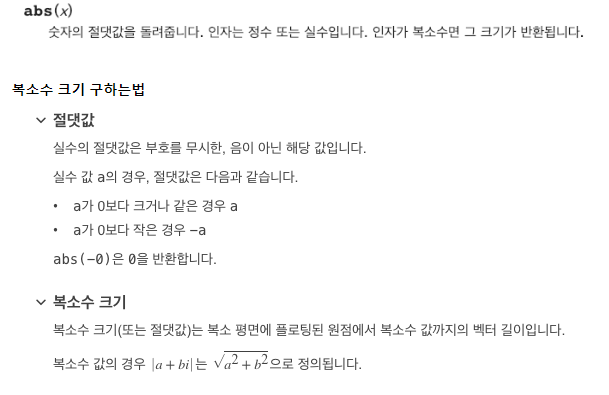
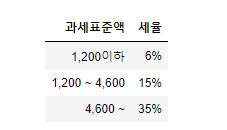

### abs(x)

> 절대값은 숫자(int, float)가 들어오면 절대값을 반환하고, 복소수(complex)가 들어오면 그 크기를 반환합니다.
>
> `my_abs(x)`를 만들어보세요



```python
def my_abs(x):
    if type(x) == type(1j):
        return (x.imag**2 + x.real**2)**(1/2)
	else:
        if x == 0:
            return 0
        elif x < 0:
            return x * -1
        else:
            return x
print(my_abs(3+4j),my_abs(0.0),my_abs(-5))
```

### all(x)

> all은 인자로 받는 iterable(range,list)의 모든 요소가 참이거나 비어있으면 True를 반환합니다.
>
> 이와 같은 my_all(x)을 작성해보세요

```python
def my_all(x):
    for i in x:
        if bool(i) == False:
            result = False
            break
        else:
            result = True
    return result
print(my_all([1, 2, 5, '6']))
print(my_all([0, 2, 5, 1]))
```

### any(x)

> any는 인자로 받는 iterable(range, list)의 요소 중 하나로도 참이면 True를 반환하고, 비어있으면 False를 반환합니다.

> 이와 같은 my_any(x)를 작성해보세요.

```python
def my_any(x):
    for i in x:
        if bool(i) == True:
            result = True
            break
        else:
            result = False
    return result
print(my_any([1, 2, 5, '6']))
print(my_any([0, 2, 5, '6']))
```

### bin(x) - 난이도 높음

> `양의 정수`를 받아서 앞에 '0b'를 붙어 있는 2진수로 표현됩니다.
>
> 이와 같은 `my_bin(x)`를 작성해보세요

- 음수는 고려하지 않아도 됩니다.

```python
def my_bin(x):
    a=[]
    while x>0:
        a.append(str(x%2))
        x=x//2
        result=list(reversed(a))
    return "0b{}".format(int(''.join(result)))

print(my_bin(10))
```

### 종합소득세 계산하기

> A라는 나라에서는 종합소득세는 과세표준 금액 구간에 따라 다른 세율이 적용됩니다.



- 즉, 1,300원을 벌었을 경우 `1,200*0.06 + 100*0.15`를 계산한 결과가 납부해야 하는 세액입니다.

  함수 `tax(won)을 만들고 납부해야하는 세금의 결과를 반환하는 함수를 만들어보세요.

----

- 예시)

  tax(1200) # => 72.0

  tax(4600) #=> 582.0

  tax(5000) #=> 722.0

```python
def solution(x):
    if x > 4600:
        result = 1200*0.06 + 3400*0.15 + (x-4600)*0.35
    elif 4600>= x > 1200:
        result = (x-1200)*0.15 + 1200*0.06
    else:
        result = x*0.06
    return "{:.1f}".format(result)
print(solution(1200))
print(solution(4600))
print(solution(5000))

#선생님 계산
def tax(won):
    if won >=4600:
        result = 1200 * 0.06 + 3400 * 0.15 + (won-4600)*0.35
    elif won >= 1200:
        result = 72 + (won-1200)*0.15
    else:
        result = won*0.06
    return result

print(tax(1100))
```

### 카쉐어링 요금 계산하기

> 카쉐어링 서비스는 요금을 다음과 같이 계산합니다.
>
> 대여는 10분 단위로 가능합니다.
>
> 1. 대여 요금 : 10분당 1,200원
> 2. 보험료 : 30분당 525원 (50분을 빌리면, 1시간으로 계산됩니다.)
> 3. 주행 요금 : km당 170원 (주행 요금 100km가 넘어가면, 넘어간 부분에 대하여 할인이 50% 적용됩니다.)
>
> 예) 160km를 달렸으면, `170*100 + 85*60`
>
> 양의 정수인 대여시간(분)과 주행거리를 받아 계산 결과를 반환하는 함수 `fee(minute, distance)`를 만들어보세요.

---

- 예시)

  fee(600, 50) #=> 91000

  fee(600, 110) #=> 100350

```python
def fee(x,y):
    if y >100:
        distance = 100*170 + (y-100)*85
    else:
        distance = y*170
    if x%30 == 0:
        bohum = (x//30)*525
    else:
        bohum = (x//30+1)*525
    minute = (x//10)*1200 + bohum 
    return distance+minute

print(fee(600, 50))
print(fee(600, 110))

#성진이 답변
def fee(minute,distance):
    result = minute * 1200 + ((minute-1)//30 + 1) *525
    if distance >100:
        result += 17000 + 85 * (distance -100)
    else:
        result += 170 * distance
    return result
```

### 이상한 덧셈

> 숫자 구성된 리스트에서 양의 정수의 합을 구하는 함수 `positive_sum`을 작성하세요.

- 예시)

  positive_sum([1,-4,7,12]) => 20

  positive_sum([-1,-2,-3,-4])=>0

```python
def positive_sum(x):
    result=0
    for i in x:
        if i>0:
            result += i
    return result

print(positive_sum([1,-4,7,12]))
print(positive_sum([-1, -2, -3, -4]))

#성진이 방법

def positive_sum(x):
    return int(sum(filter(lambda a: a>0, x)))
```

### Collatz

> 1973년 Collatz란 사람에 의해 제기된 이 추측은, 주어진 수가 1이 될때까지 다음 작업을 반복하면, 모든 수를 1로 만들 수 있다는 추측입니다. 작업은 다음과 같습니다.
>
> 1. 입력된 수가 짝수라면 2로 나눕니다.
> 2. 입력된 수가 홀수라면 3을 곱하고 1을 더합니다.
> 3. 결과로 나온 수에 같은 작업을 1이 될 때까지 반복합니다.
>
> 예를 들어, 입력된 수가 6이라면 6=>3=>10=>5=>16=>8=>4=>2=>1이 되어 총 8번만에 1이 됩니다.
>
> 위 작업을 몇 번이나 반복해야하는지 반환하는 함수, collatz를 완성해 주세요.
>
> 단, 작업을 500번을 반복해도 1이 되지 않는다면 -1을 반환해 주세요.

```python
def collatz(x):
    count =0
    try:
        while x!=1:
            if x % 2 == 0:
                x = x/2
            else:
                x= x*3+1
            count +=1
            if count == 500:
                raise Exception
        return count
    except Exception:
        return -1
    
print(collatz(6))
print(collatz(16))
print(collatz(27))
print(collatz(626331))
```

### 솔로 천국 만들기

> 리스트가 주어집니다. 리스트의 각 요소는 숫자 0부터 9까지로 이루어져 있습니다.
>
> 이때, 리스트에서 연속적으로 나타나는 숫자는 하나만 남기고 전부 제거하려고 합니다.
>
> 리스트에서 연속적으로 나타나는 숫자는 제거하고 남은 수들을 반환하는 lonely 함수를 작성해 주세요.
>
> 단, 제거된 후 남은 수들을 반환할 때는 리스트의 요소들의 순서를 유지해야 합니다.

```python
def lonely(x):
    count = 1
    while count != len(x):
        if x[count-1] == x[count]:
            del x[count-1]
            print(x)
        else:
            count +=1
    return x
print(lonely([1, 1, 3, 3, 0, 1, 1]))
print(lonely([4,4,4,3,3]))
```

