# Week7_Day1 2019-01-21

## 문제풀이

**Class 생성자 문제**

```
p1 = Person(p1,'hong',100)
p2 = Person('kim')
p3 = Person(age = 3, name = 'kim') ==> 정답
p4 = Person()
```

```python
class Person:
    def __init__(self,name,age):
        self.name = name
```

**Update 문제**

```
len(a1)은 2이다.
a1과 a2는 같은 딕셔너리를 가리키고 있다.
에러가 발생한다.
보기 중에 답이 없다. ==> 정답
```

```python
d = {'a' : 1, 'b' : 2}
a1 = d.update(c=3)
a2=a1
```

**Function**

```
80 ==> 정답
81
82
83
```

```python
def func(a, b = 1, c = 2, *args, **kwargs):
    d = sum([n*2 for n in args if n>2])
    e = sum([v*v for k, v in kwargs.items()])
    return a + b + c + d + e

print(func(9, 4, 2, 3, 1, 7, d=3, e=6))
```

**Fucntion**

```python
a = 1
def my_func_1():
    a = 5
    my_func_2()
    
def my_func_2():
    print(a, end='')
    
my_func_1()
print(a)
```

```
11
```

```python
a = 1
def my_func_1():
    a = 5
    def my_func_2():
        a=7
        print(a+1)
        def my_func_3():
            print(a)
            print('my_func_3 실행 종료')
        my_func_3()
        print('my_func_2 실행 종료')
   	my_func_2()
    print('my_func_1 실행 종료')
my_func_1()
```

```
8
7
my_func_3 실행 종료
my_func_2 실행 종료
my_func_1 실행 종료
```


## 웹 사이트를 만들기

- 우리는 원래 다른 곳에 요청을 하여서 응답을 받아 서비스를 했는데, 이제는 우리가 요청을 받을 것이다.
- 우리는 서버컴퓨터에서 요청과 응답을 처리할 프로그램을 개발한다. (유저들에게 html 문서 하나를 보내 줄 것이다)
- chrome extenseion 중에 `web developer extension`을 확장 프로그램 추가할 것이다.
  - 여기서 `information`에서 `view document Outline`을 하면 html을 구조화 시켜서 보여준다.

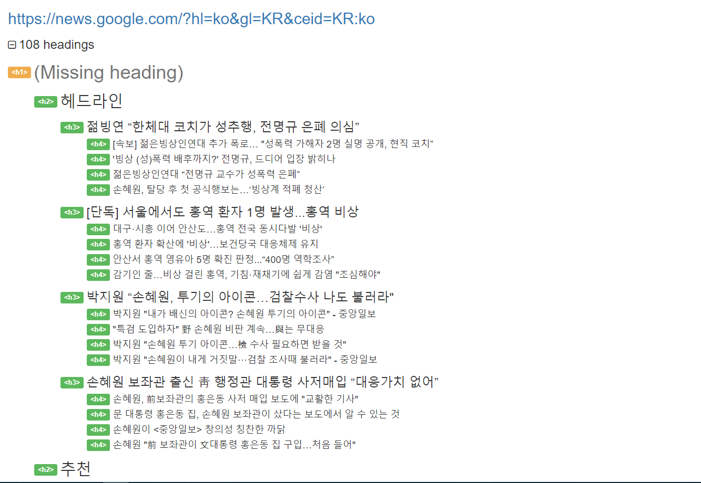

- 216.58.196.228(IP) 구글의 주소임. 이 것을 주소창에 넣으면 구글 홈페이지로 간다. (주소라고 생각하면 된다)
  - 하지만 이렇게 사용하면 외우기 어려워서 google.com으로 도메인을 씌웠다.
  - URL은 https://www.google.co.kr/search?q=구글 이런 애들이 URL이다.
  - 우리도 이렇게 만들 것이다. 근데 도메인은 사야함. 우리는 aws route 53 서비스를 이용할 것이다.
  - 도메인을 세계적으로 관리하는 기간인 who is라고 있다.
- 무조건 하나의 응답을 주는 애들이 Statics web / 요청에 맞게 응답을 주는 애들이 daynamic web


## HTML이 뭐죠

- W3C - 웹 표준, HTML/CSS의 표준을 만들어내는 곳이 W3C이다. 근데 우리는 표준이 잘 정리된 소스를 공부할 것이다.
- HTML을 MDN 웹 문서에서 상세히 배울 수 있다.
- Hyper Text Markup Language(HTML)는 한장, 한장 순서가 있는 것이 아니라 텍스트를 넘어서 돌아다닐 수 있는 장점이 있다.
- Hyper Text Transfer Protocol(http)는 HTML을 주고 받는 방법이라한다.
- **웹 페이지를 작성하기 위한 역할 표시 언어**
- 근데 우리는 이틀 동안 CSS를 배우는데 CSS는 별 다른 거 없고 웹을 꾸미는 것을 말한다.

1. HTML의 기본 구조

   1. DOCTYPE, html 요소(머리 - 문서 전반적인 지식, 바디 - 떨거지)

2. HTML 요소

   1. `<h1> </h1>   여는 태그 + 닫는 태그` 혹은 `` 와 같은 self closing 태그도 있고 `<a href = 'google.com'></a>`과 같이 속성을 부여하는 태그도 있따.

   2. HTML은 DOM Tree 형식이다. 아래 사진과 같이

      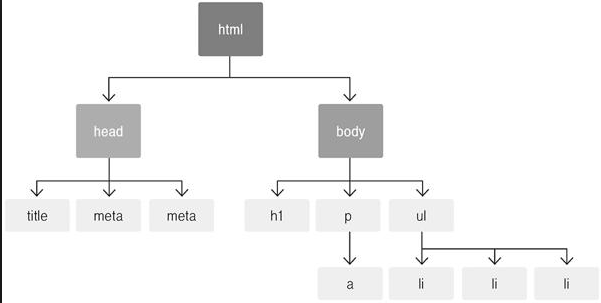

      3. 시맨틱태그

         1. 컨텐츠 의미를 설명하는 태그이다. (`<header>` 태그와 같은 친구)

         2. 최근 웹들은 이러한 부분들을 구분지어 놓는다.

         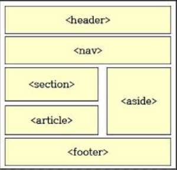

         3. 구글 뉴스, 네이버 뉴스를 뒤져보면 시맨틱태그의 표준을 어떻게 지키고 있는지 알 수 있다.

         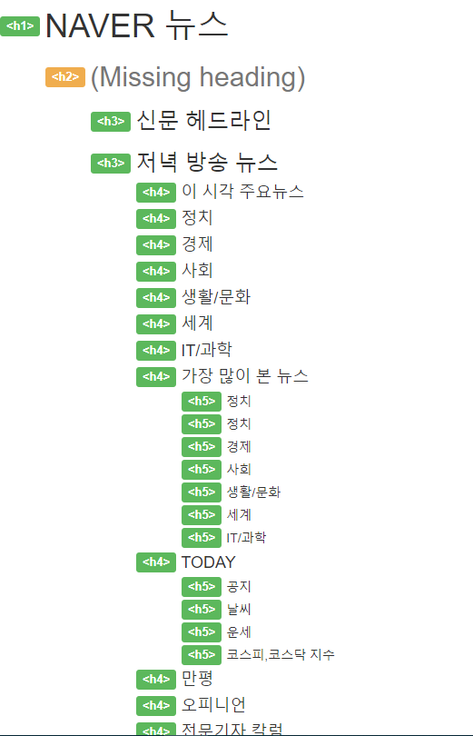

         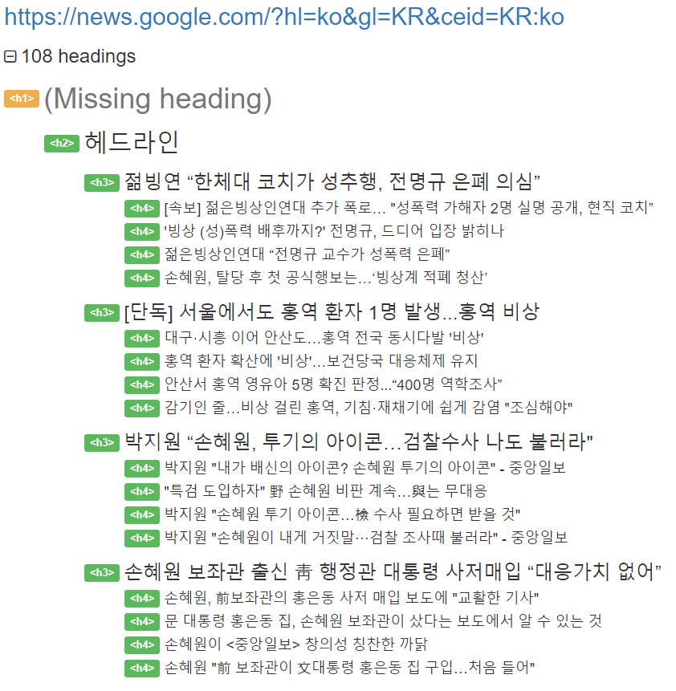

         밑에게 구글인데 구글이 네이버보다 정갈하고 정보도 잘 보여주기 때문에 잘 짜여놓은 태그이다.

      4. 개발자 및 사용자 뿐만 아니라 검색엔진(구글, 네이버) 등에도 눈에 띄여야 검색이 잘 되기 때문에 시맨틱태그를 잘 짜놓는 것이 필요하다. (구글이 해놓은거처럼 구조를 잘 짜놓으면 위의 예시처럼 검색이 잘 된다)

      5. 참고로 h1태그는 하나가 있는 것이 중요하다. 왜냐면 검색엔진이 딱!!하고 볼 수 있는 것이 h1인데 안그러면 헷갈림. 부제목을 위해선 다른 것을 써야한다.


## HTML 실습하기 !

1. mkdir frontend => cd fronted => code . => python.html 파일 생성

   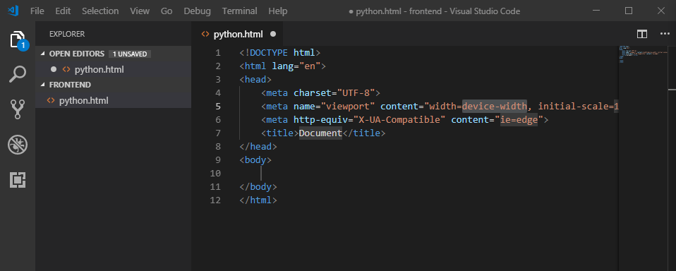

2. 참고로 결과 보는 법은 2가지 방법이 있다.

   1. 미리보기
   2. 폴더 내부에서 직접 파일을 실행하는 것 (얘를 쓰자)

3. 결과

   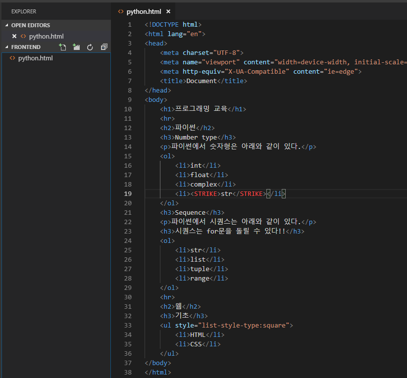

   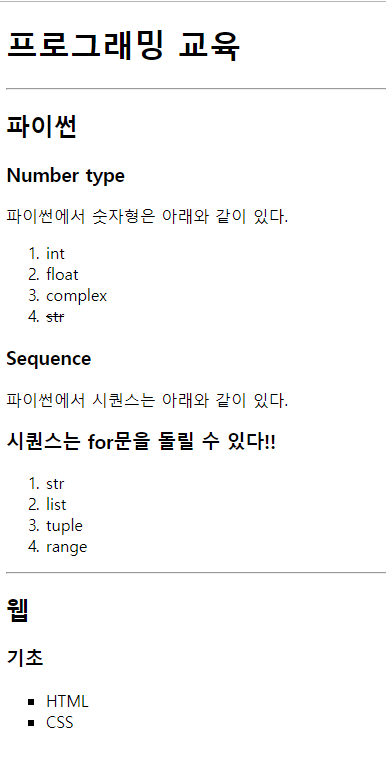

   참고로 마지막 `<ul style="list-style-type:square">`에서 style이 없으면 꽉찬 동그라미이다. square 대신 circle하면 동그라미 만약 `<li style="list-style-type:circle">HTML</li>`을 한다면 HTML만 동그라미로 바뀐다. (Inline styling)

   그리고 `<STRIKE></STRIKE>`사이에는 줄로 그어진 텍스트를 넣을 수 있다.

   아래처럼 몇개 뚝딱뚝딱하면 웹을 꾸밀 수 있다.

   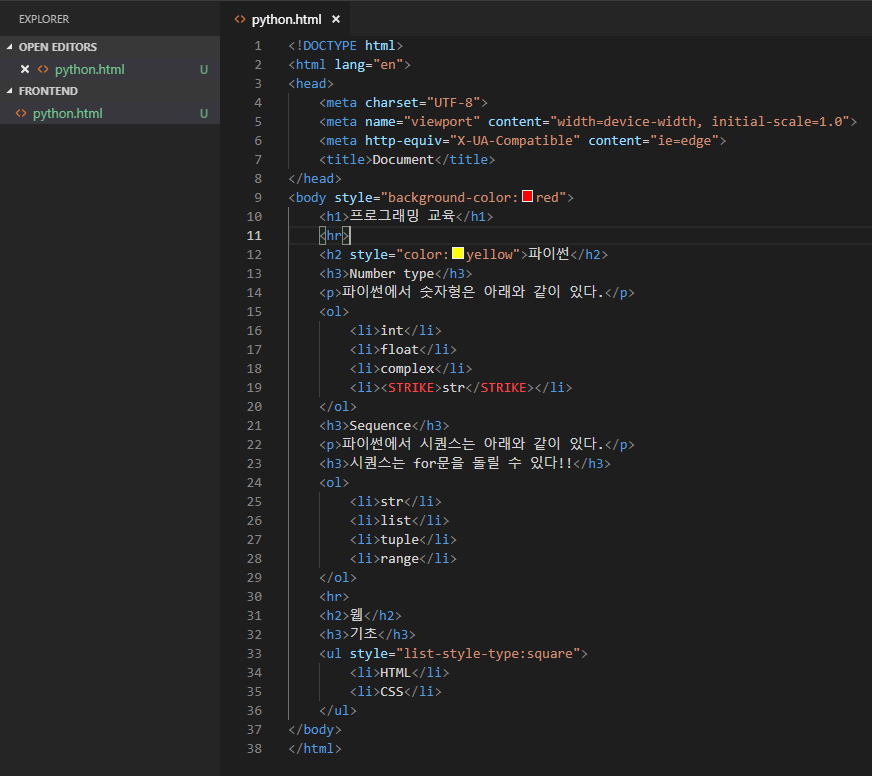

   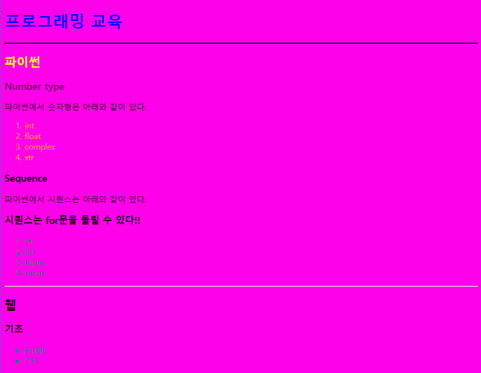

## CSS 다루기

- HTML을 꾸며주는 친구가 CSS이다. HTML이 구조화를 잡아주면 CSS는 스타일링을 해주는 친구이다.
- 근데 둘이 다른 언어이다. HTML은 Markup language이고 CSS는 CSS만의 언어를 쓴다.

**기본 문법**

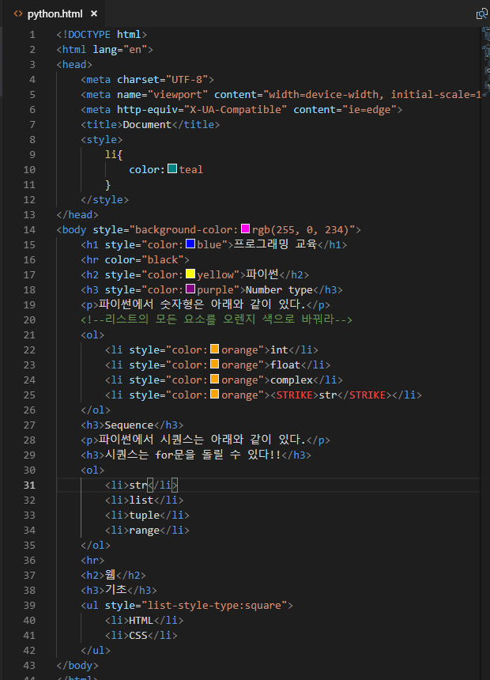

제일 위에 `<style>li{color:teal}</style>`때문에 모든`<li></li>` 부분을 전부 teal 색깔로 바꿔준다. (앞에 . 찍으면 클래스를 만드는 것)

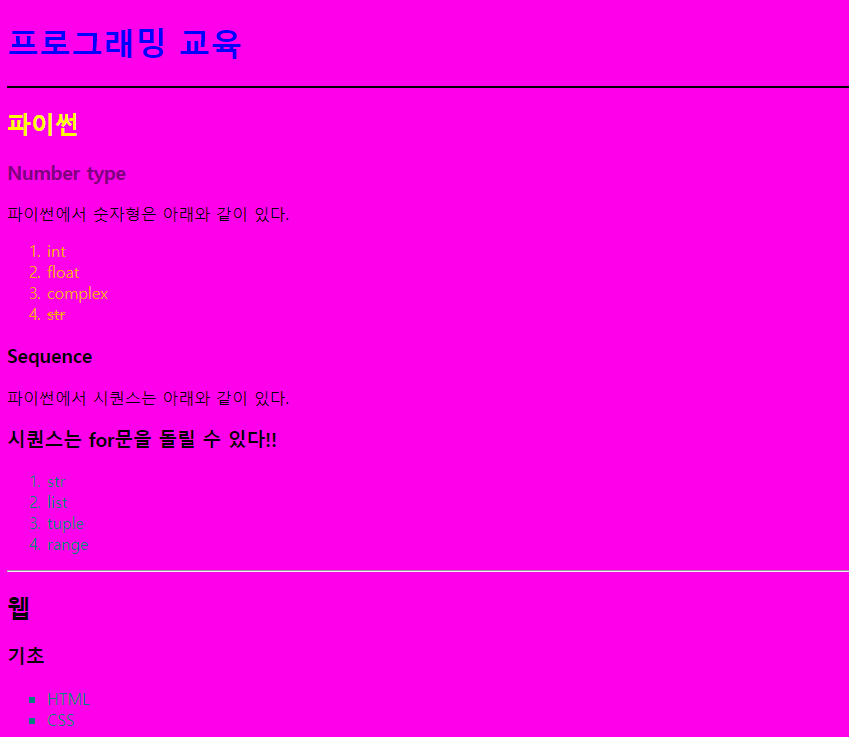

근데 위에 우리가 `style`선언을 했지만 `orange`는 바뀌지 않았다. 우선순위가 `orange`에 있기 때문이다. 국제법이 있다하더라도 고등학교에 법이 고등학생한테 우선되는거와 똑같다.

- `poiemaweb.com`는 CSS, HTML 사용 방법이 가장 잘 정리된 사이트이다.

- CSS에도 클래스가 있다. 약간 함수선언하고 태그에다가 집어넣는 느낌이다.

  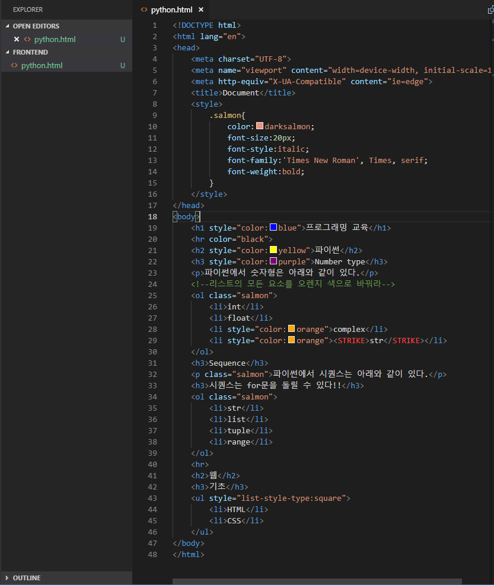

  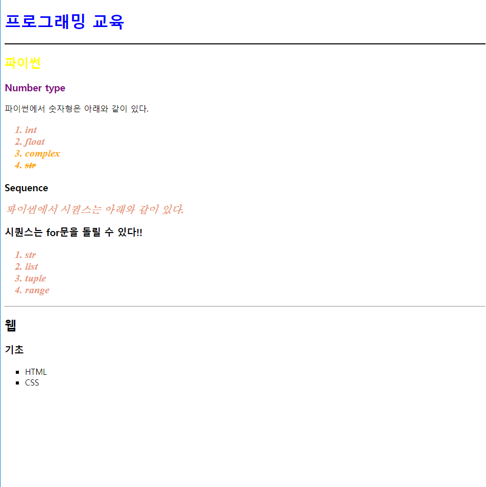

- 그렇다면 inline으로 넣은 것들을 class를 만들어보쟈.

  ```python
  <!DOCTYPE html>
  <html lang="en">
  <head>
      <meta charset="UTF-8">
      <meta name="viewport" content="width=device-width, initial-scale=1.0">
      <meta http-equiv="X-UA-Compatible" content="ie=edge">
      <title>Document</title>
  </head>
  <body>
      <h1 class='a'>프로그래밍 교육</h1>
      <hr class='d'>
      <h2 class='b'>파이썬</h2>
      <h3 class='c'>Number type</h3>
      <p>파이썬에서 숫자형은 아래와 같이 있다.</p>
      <!--리스트의 모든 요소를 오렌지 색으로 바꿔라-->
      <ol class="salmon">
          <li>int</li>
          <li>float</li>
          <li>complex</li>
          <li><STRIKE>str</STRIKE></li>
      </ol>
      <h3>Sequence</h3>
      <p class="salmon">파이썬에서 시퀀스는 아래와 같이 있다.</p>
      <h3>시퀀스는 for문을 돌릴 수 있다!!</h3>
      <ol class="salmon">
          <li>str</li>
          <li>list</li>
          <li>tuple</li>
          <li>range</li>
      </ol>
      <hr class='d'>
      <h2>웹</h2>
      <h3>기초</h3>
      <ul class='e'>
          <li>HTML</li>
          <li>CSS</li>
      </ul>
  </body>
  </html>
  ```

- 근데 이렇게 class를 늘리다보면 대두가 되어버린다.

- 그래서 따로 파일을 만들어서 python에서 import하는 식으로 사용을 해보자

  - `style.css`파일을 새로 만들자 그리고 스타일 태그에 있는 모든 애들을 잘라서 그 파일 안에 넣자

    ```css
    .salmon{
        color:darksalmon;
        font-size:20px;
        font-style:italic;
        font-family:'Times New Roman', Times, serif;
        font-weight:bold;
    }
    .a{
        color:darkred;
    }
    .b{
        color:deeppink;
    }
    .c{
        color:darkviolet;
    }
    .d{
        height:10px;
        border:none;
        background-color:darkseagreen;
        color:black;
    }
    .e{
        list-style-type:square
    }
    ```

    이것만 남도록

  - 그런 다음에 `python.html` 파일에다가 `<link rel="stylesheet" href="style.css">`을 해주자`(<head> 부분에)`

  - 이렇게 하면 끝 !

    ```css
    <!DOCTYPE html>
    <html lang="en">
    <head>
        <meta charset="UTF-8">
        <meta name="viewport" content="width=device-width, initial-scale=1.0">
        <meta http-equiv="X-UA-Compatible" content="ie=edge">
        <title>Document</title>
        <link rel="stylesheet" href="style.css">
    </head>
    <body>
        <h1 class='a'>프로그래밍 교육</h1>
        <hr class='d'>
        <h2 class='b'>파이썬</h2>
        <h3 class='c'>Number type</h3>
        <p>파이썬에서 숫자형은 아래와 같이 있다.</p>
        <!--리스트의 모든 요소를 오렌지 색으로 바꿔라-->
        <ol class="salmon">
            <li>int</li>
            <li>float</li>
            <li>complex</li>
            <li><STRIKE>str</STRIKE></li>
        </ol>
        <h3>Sequence</h3>
        <p class="salmon">파이썬에서 시퀀스는 아래와 같이 있다.</p>
        <h3>시퀀스는 for문을 돌릴 수 있다!!</h3>
        <ol class="salmon">
            <li>str</li>
            <li>list</li>
            <li>tuple</li>
            <li>range</li>
        </ol>
        <hr class='d'>
        <h2>웹</h2>
        <h3>기초</h3>
        <ul class='e'>
            <li>HTML</li>
            <li>CSS</li>
        </ul>
    </body>
    </html>
    ```

### 이렇게 3가지를 직접 해보았다. inline / class로 따로 떼어놓기 / 파일을 따로 만들기 이거 3개 시험에 나온다 ! (구분 세미콜론 `;` 쓰는 것을 인지하자)

- 우선순위는 inline -> html 파일 내부에서 class로 따로 떼어놓기 -> 파일을 따로 만들기 순으로 인지한다. inline이 제일 강함.

- **inline**

  ```html
  <h3 style="color:green">
    	얍얍
  </h3>
  ```

- **class로 따로 떼어놓기**

  ```html
  <style>
      li{
          color : pink;
          font-size : 50px;
      }
  </style>
  ```

- **css 파일 만들기**

  ```html
  .salmon{
  	color : pink;
      font-size : 50px;
  }
  li{
      font-weight : bold;
  }
  
  <!--불러와줘야한다-->
  <link rel="stylesheet" href="style.css">
  ```


`h1 {color:blue;font-size:15px;}` python에서 key값에 위치하는 친구가 property이다. 그리고 value 자리에는 `키워드(rgb), 색깔(255,255,255)/(#FFFFFF), 크기단위(픽셀)`=>픽셀은 상대적인 값이다. 브라우저에서는 절대화 시키긴했다. (1px을 기준으로 1/96 인치)

- 참고로 #FFFFFF는 흰색인데 16진수로 나타낸것이다. 즉 rgb(255,255,255)와 같다. 16*16=256인데 0을 포함하니까 255


## `<div>` `<p>` 태그의 차이점

1. `<div>` 태그나 `<p>` 태그는 왼쪽에서 오른쪽으로 하나의 가로 영역(Block) 전체를 차지하는 태그들이다.

   Block - level Element이다.

2. `<div>` 태그는 html 문서를 위에서부터 아래로 분할하는 역할을 한다.

3. `<p>` 태그는 html 문서 안에서 문장의 단락을 나타내는 태그이다. (긴 글의 단락)

4. 각 태그들을 2번 3번 처럼 목적에 맞춰서 사용하여 html 문서를 작성하면 의미적/구조적으로 잘 짜여진 html 문서가 되며 다른 장ㅊ들과의 호환을 극대화 할 수 있다.

5. `<p>` 태그는 태그 자체에 상/하 마진을 가지고 있다.

```html
<html>
	<body>
		<p>first paragraph</p>
		<p>second paragraph</p>
		<p>
			new line<br>
			third paragraph
		</p>
	</body>
</html>
```

> 결과

```html
first paragraph

second paragraph

new line
third paragraph
```

```html
<html>
	<body>
		<div style="background-color:cyan">구역1</div>
		<div style="width:100px; height:100px; background-color:#CF0">구역2</div>
	</body>
</html>
```

> 결과


## `<span>` 태그

1. `<span>` 태그는 자신이 갖고 있는 고유한 영역이 없이 자신이 둘러싸고 있는 내용물의 양과 크기에 의존한다.
2. 그 높이는 한 줄에 대한 높이이고, 그 길이는 태그가 열리는 곳부터 닫히는 곳 까지이다.
3. 다시말 해 span 태그는 블락이 아닌 줄의 단위다.
4. 이런 애들은 Inline-level Element이다.

```html
<html>
<body>
	<span style="background-color:red">span1</span>
	<span style="background-color:blue">span2</span>
	<span style="background-color:green">span3</span>
</body>
</html>
```

> 결과

```html
span1 span2 span3
```

## `<a>` 태그

1. 하이퍼링크를 걸어주는 태그이다.
2. href : 클릭시 이동 할 링크
3. target : 링크를 여는 방법
   - _self : 현재 페이지 (default)
   - _blank : 새 탭
   - _parent : 부모 페이지로, iframe 등이 사용된 환경에서 쓰인다.
   - _top : 최상위 페이지로, iframe 등이 사용된 환경에서 쓰인다.
   - 프레임이름 : 직접 프레임 이름을 명시해서 사용