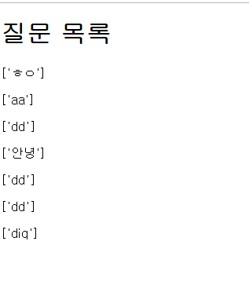
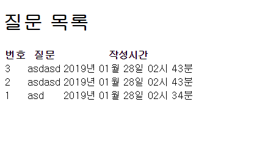
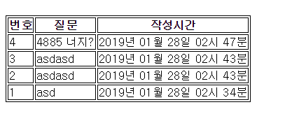
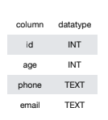
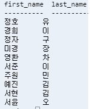
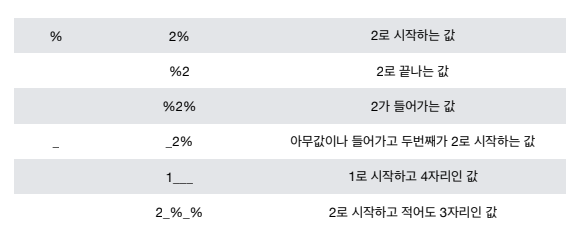

# 2019-01-28

- 시험 끝나고 피자 먹는다.
- 시험문제는 되게 쉽고, 주간 평가 범위에서 풀었던 문제에서 나온다.
- 혼자 SQL 공부를 하고 싶으면 w3schools.com을 하면 된다.

## 익명 질의응답 앱 만들어 보기

### 플라스크 앱 만드는 순서

1.  '/' -> index.html

   - form
     1. 사용자의 입력을 받음
     2. 입력 받은 값을 question이라는 상자에 넣어서
     3. '/ask' 주소로 보내준다.

2. '/ask' -> ask.html

   - ask.html : <h1>''성공적으로 질문이 업로드 되었습니다.'' 라는 메시지가 뿅 뜨게 만들 것이다.<h1>

   - 질문 저장

     - csv 파일에 저장

   - question.csv 파일 안에는 

     ```csv
     설에 뭐하니?
     주말에는 뭐하니?
     ```

3. '/quest' ->quest.html

   - 지금까지 입력 받은 모든 질문을 보여줄 것이다.
     1. question.csv에 있는 파일 내용을 읽어와서
     2. quest.html에서 보여준다. (csv.reader를 사용하고 for문을 통해서 리스트를 벗겨야한다.(2중 for문이라서))

### 실습 

1. c9.io에서 새로운 workspace를 만들자 (이름은 asked)

2. flask를 다운 받자

   > workspace

   ```python
   $ sudo pip3 install flask
   ```

3. app.py의 파일을 만들고 아래와 같이 작성을 하자

   > app.py

   ```python
   from flask import Flask, render_template
   #Flask는 클래스이다.
   
   app = Flask(__name__) #객체를 만들었다. #__name__을 하면 자기 자신 파일 명이 들어간다.
   
   @app.route('/') #명세 1번 먼저 해보자. #'/' 이 친구의 요청이 들어온다면 아래의 함수를 실행한다.
   def index():
       return render_template('index.html') #render_template을 쓰기 위해선 import를 해야한다. 만약 import 안 할거면 flask.render_template하고 쓰면된다.
   #'/'라는 인자가 들어오면 'index.html'을 실행하기 위해서 함수 인자 안에다가 'index.html'을 실행한다.
   ```

4. 이제 index.html 파일을 만들어보자

   > index.html

   ```python
   <!DOCTYPE html>
   <html lang="en">
   <head>
       <meta charset="UTF-8">
       <meta name="viewport" content="width=device-width, initial-scale=1.0">
       <meta http-equiv="X-UA-Compatible" content="ie=edge">
       <title>Document</title>
   </head>
   <body>
       <h1>익명 질문 앱</h1>
       <p>익명으로 질문하세요.</p>
       <form>
           <input type="text" name="question"/>
           <input type="submit" value="Submit"/>
       </form>
   </body>
   </html>
   ```

5. 이제 파일을 돌려보는데 아래와 같은 명령어를 치면된다.

   > workspace

   ```python
   $ flask run --host=0.0.0.0 --port=8080
   # 반드시 python의 이름은 app.py가 되어야 얘가 읽을 수 있다.
   ```

### 제작

1. index.html에서 form에다가 새로운 속성을 붙여야한다.

   > index.html

   ```html
       <form action='/ask'>
           <input type="text" name="question"/>
           <input type="submit" value="Submit"/>
       </form>
   ```

2. ask로 보낸다고 명령했으니까 새로 html과 함수를 만들어야한다.

   > app.py

   ```python
   @app.route('/ask')
   def ask():
       return render_template('ask.html')
   ```

   > ask.html

   ```html
   <!DOCTYPE html>
   <html lang="en">
   <head>
       <meta charset="UTF-8">
       <meta name="viewport" content="width=device-width, initial-scale=1.0">
       <meta http-equiv="X-UA-Compatible" content="ie=edge">
       <title>Document</title>
   </head>
   <body>
       <h1>"성공적으로 질문 업로드 되었습니다."</h1>
   </body>
   </html>
   ```

3. 근데 우리가 submit 칸에 입력을 해도 ask.html에 값이 날라가지 않는다. 그리고 파이썬에 list, dict으로 저장이 가능하지만 이러면 컴퓨터를 끄고 다시 보면 저장된 메모리가 다 날라가기에 우리는 csv로 만들 것이다.

   > app.py

   ```python
   @app.route('/ask')
   def ask():
       quest = request.args.get('question') #request를 사용하기 위해선 앞서서 import request를 해야한다. 그리고 이 변수를 quest에다가 담아 주었다.
       # print(quest) # 이러면 quest에 담긴 값을 확인 가능
       # dictionary = > {'question':'사용자가 입력한 값'} 아마 이런식으로 html에서 인풋을 받을 것이다.
       return render_template('ask.html', quest=quest)
   ```

   그리고 이제 quest를 csv로 저장해보자

   > app.py

   ```python
   import csv
   ...
   ...
   @app.route('/ask')
   def ask():
       quest = request.args.get('question')
       #csv 파일로 저장하기
       with open('question.csv','a') as f: #w는 쓰기 위해서 a는 데이터를 쌓기 위해서
           writer = csv.writer(f) #쓸 수 있는 친구로 만들기 위해서 wirter에 담았다.
           writer.writerow([quest]) #특정한 파일을 쓸 수 있게하는 메소드 근데 writerow 안에는 무조건 리스트가 들어가야한다.
       return render_template('ask.html', quest=quest)
   ```

   이 상태에서 서버를 돌리고 입력을 하면 workspace에 question.csv 파일이 생긴다. 

4. 이제는 csv 파일을 만들었으니 그 안에 있는 정보를 quest.html에 띄울 것이다.

   > app.py

   ```python
   @app.route('/quest')
   def quest():
       #question.csv에 있는 내용을 quest.html에서 보여주도록하자.
       quest_list = []
       with open('question.csv','r') as i:
           rdr = csv.reader(i) #i를 그대로 쓸 수도 있지만 우리가 조작하기 힘들다. 그래서 csv.reader를 사용한다. 근데 이게 가공이 안되어서 다시 새로운 리스트에 가공을 해주어야한다.
           # 리더 안에는 [['ㅎㅇ'],['안녕']] 이런식으로 되어 있을 것이다.
           for row in rdr:
               quest_list.append(row)
           # quest_list에는 [['ㅎㅇ'],['안녕']]으로 되었을 건데
       return render_template('quest.html', quest_list=quest_list)
   ```

   이제 quest.html에서 가꾸도록 하자.

   > quest.html

   ```html
   <!DOCTYPE html>
   <html lang="en">
   <head>
       <meta charset="UTF-8">
       <meta name="viewport" content="width=device-width, initial-scale=1.0">
       <meta http-equiv="X-UA-Compatible" content="ie=edge">
       <title>Document</title>
   </head>
   <body>
       <h1>질문 목록</h1>
       <!--얘는 html 안에서 for문을 돌게 해주는 함수이다.-->
        <!--마지막에 ':' 할 필요가 없다.-->
       <p>
           {{x}}
       </p>
       
   </body>
   </html>
   ```

   이렇게 하고나서 `http://asked-rrkkee015-1.c9users.io:8080/quest` Url로 들어가면 아래와 같이 뜬다.

   

   근데 `[]`이게 보기 싫으니까 0번째 요소를 추가해주면 된다. `{{x[0]}}` 이런 식으로

5. 이제 이 질문을 언제 했는지 알고 싶어서 datetime을 사용할 것이다.

   > app.py

   ```python
   import datetime #datetime을 쓰기위해서 import 했다.
   ...
   ...
   @app.route('/ask')
   def ask():
       quest = request.args.get('question')
       #csv 파일로 저장하기
       #[질문, 날짜 + 시간]
       time = datetime.datetime.now()
       dt = time.strftime("%Y년 %m월 %d일 %H시 %M분") #가공해야하니까 strftime 메소드를 사용
       q_list=[quest, dt]
       with open('question.csv','a') as f: #w는 쓰기 위해서
           writer = csv.writer(f) #쓸 수 있는 친구로 만들기 위해서 wirter에 담았다.
           writer.writerow([q_list]) #특정한 파일을 쓸 수 있게하는 메소드 근데 writerow 안에는 무조건 리스트가 들어가야한다.
       return render_template('ask.html', quest=q_list)
   ```

   그러면 입력을 하게되면 아래와 같은 시간이 뜬다.

   

   근데 여기서 q_list를 리스트로 보냈기 때문에 `writer.writerow([q_list])`에서 리스트를 지워줘야 한다.

6. 근데 이렇게 하면 옛날 것들이 제일 위로 가기 때문에 `reversed`함수를 써서 제일 최신 것들을 위로 오게 만들어 주자. (맨 마지막 줄 참고)

   > app.py

   ```python
   @app.route('/quest')
   def quest():
       #question.csv에 있는 내용을 quest.html에서 보여주도록하자.
       quest_list = []
       with open('question.csv','r') as i:
           rdr = csv.reader(i) #i를 그대로 쓸 수도 있지만 우리가 조작하기 힘들다. 그래서 csv.reader를 사용한다. 근데 이게 가공이 안되어서 다시 새로운 리스트에 가공을 해주어야한다.
           # 리더 안에는 [['ㅎㅇ'],['안녕']] 이런식으로 되어 있을 것이다.
           for row in rdr:
               quest_list.append(row)
           # quest_list에는 [['ㅎㅇ'],['안녕']]으로 되었을 건데
       return render_template('quest.html', quest_list=reversed(quest_list))
   ```

7.  이제는 자료가 몇 번째 자료인지 알기 위해서 csv 내부에서 숫자를 값을 주도록 하자. 그러기 위해선 question.csv 파일에 질문이 몇 개 있는지 확인을 해야한다. 파일을 한 번 열고 그 속에서 리스트가 몇 개인지 확인해야하는 작업이 되어야한다. **(쉽지 않은 작업)**

   > app.py

   ```python
   @app.route('/ask')
   def ask():
       quest = request.args.get('question')
       #csv 파일로 저장하기
       #[질문, 날짜 + 시간]
       q_list=[]
       time = datetime.datetime.now()
       dt = time.strftime("%Y년 %m월 %d일 %H시 %M분")
       with open('question.csv','a') as f:
           writer = csv.writer(f)
           num = 0
           with open('question.csv', 'r') as fi:
               #reader = csv.reader(fi) #이렇게 하면 for로 한 번 가공을 시켜줘야한다.
               num = len(list(csv.reader(fi))) #이러면 바로 list로 바꿔준다.
               q_list=[num+1, quest, dt]
           writer.writerow(q_list)
       return render_template('ask.html', quest=q_list)
   ```

   > quest.html

   ```html
   <!DOCTYPE html>
   <html lang="en">
   <head>
       <meta charset="UTF-8">
       <meta name="viewport" content="width=device-width, initial-scale=1.0">
       <meta http-equiv="X-UA-Compatible" content="ie=edge">
       <title>Document</title>
   </head>
   <body>
       <h1>질문 목록</h1>
       <!--얘는 html 안에서 for문을 돌게 해주는 함수이다.-->
        <!--마지막에 ':' 할 필요가 없다.-->
       <p>
           번호 : {{x[0]}} 질문 : {{x[1]}}, 작성시간 : {{x[2]}}
       </p>
       
   </body>
   </html>
   ```

   리스트의 항목이 늘어났으니 x[0], x[1], x[2] 3가지가 있어줘야 한다.

8. 근데 quest.html에 테이블을 만들어보자. 맨 위에 번호, 질문, 작성시간이 있어야함.

   > quest.html

   ```html
   <!DOCTYPE html>
   <html lang="en">
   <head>
       <meta charset="UTF-8">
       <meta name="viewport" content="width=device-width, initial-scale=1.0">
       <meta http-equiv="X-UA-Compatible" content="ie=edge">
       <title>Document</title>
   </head>
   <body>
       <h1>질문 목록</h1>
   	<!--테이블 태그를 만들어야한다.-->
       <table>
           <thead>
               <tr>
                   <th>번호</th>
                   <th>질문</th>
                   <th>작성시간</th>
               </tr>
           </thead>
           <tbody>
       		<!--얘는 html 안에서 for문을 돌게 해주는 함수이다.-->
                <!--마지막에 ':' 할 필요가 없다.-->
               <tr>
                   <td>{{x[0]}}</td>
                   <td>{{x[1]}}</td>
                   <td>{{x[2]}}</td>
               </tr>
               
           </tbody>
       </table>
   </body>
   </html>
   ```

   

9. 얘를 꾸며보고 싶다면 class를 헤드에 선언해보자 `<style></style>` 내부만 확인하면 된다.

   ```html
   <!DOCTYPE html>
   <html lang="en">
   <head>
       <meta charset="UTF-8">
       <meta name="viewport" content="width=device-width, initial-scale=1.0">
       <meta http-equiv="X-UA-Compatible" content="ie=edge">
       <title>Document</title>
       <!--꾸미기 위해서 style을 추가했다.-->
       <style>
           table, tr, td {
               border : 1px solid black;
           }
       </style>
   </head>
   <body>
       <h1>질문 목록</h1>
       <!--얘는 html 안에서 for문을 돌게 해주는 함수이다.-->
       <table>
           <thead>
               <tr>
                   <th>번호</th>
                   <th>질문</th>
                   <th>작성시간</th>
               </tr>
           </thead>
           <tbody>
                <!--마지막에 ':' 할 필요가 없다.-->
               <tr>
                   <td>{{x[0]}}</td>
                   <td>{{x[1]}}</td>
                   <td>{{x[2]}}</td>
               </tr>
               
           </tbody>
       </table>
   </body>
   </html>
   ```

   

## 오후

- 구글 드라이브에 새로운 slides가 올라왔다. 그것을 참고하도록 하자.

###  Database SQL 기초

- 구글은 검색 엔진의 데이터를 모은 곳이고, 유튜브는 동영상의 데이터를 모은 곳이고, 인스타는 사진의 데이터를 모은 곳이다. 모두 Datebase 기반이다.

- **Database란?**
  - **체계화**된 데이터의 모임이다.
- RDBMS(관계형데이터베이스 관리 시스템) 혹은 줄여서 RDB
  - 관계형 모델을 기반으로하는 데이터베이스 관리시스템이다.
  - 간단하게 축약하면 엑셀이다. 모든 데이터가 테이블로 저장해서 담는 것이고, 그리고 행과 열로 데이터를 담는 것이다.
  - 대표적인 오픈소스 RDBMS 중 2가지를 배울 것인데, **PostgreSQL, SQLite**를 쓸 것이다. 회사들마다 기능이 조금씩 다를 뿐이지 두가지 쓰면 다 잘한다.
- **SQLite**
  - 기가지니, 냉장고 등 임베디드 소프트웨어에 많이 쓰이는 데이터베이스가 SQLite이다. 그리고 구글 안드로이드 운영체제에 기본적으로 탑재된 데이터베이스이다. **오픈소스**이다.

### 데이터 베이스 기본 용어 정리

- 스키마(schemae)

  - 데이터베이스에서 자료의 구조, 표현방법, 관계등을 정의한 구조.

  - 파이썬의 자료형과 비슷하다.

  - 데이터베이스의 청사진이 스키마이다.

    

- 테이블

  - 데이터베이스의 구조와 제약 조건에 관련한 전반적인 명세를 기술한 것
  - 행(Row),레코드
    - 테이블의 데이터가 저장되는 곳
  - 열(Column)
    - 데이터의 타입을 정하는 곳

- **PK(기본키)** (아주 중요한 친구) 

  - 각 행(레코드)의 고유값으로, Primary key로 불린다. 반드시 설정해야한다. 데이터베이스 관리 및 관계 설정시 주요하게 활용. 즉, 정보를 찾기 위한 주된 방법

### 1.SQL 개념

- SQL 이란?
  - 관계형 데이터베이스 관리시스템(RDBMS)의 데이터를 관리하기 위해 설계된 **특수 목적의 프로그래밍 언어**
    - 데이터 베이스를 조작하기 위한 특정 목적 언어, 파이썬은 범용 목적 언어임
  - 관리 시스템에서 자료의 검색과 관리, 스키마 생성과 수정, 데이터베이스 객체 접근 조정 관리를 위해 고안되었다.
  - 엑셀에서 행과 열을 직접 GUI가 아니라 직접 언어로 가르키는 것이 SQL이다.

- C9에서는 sqlite3가 내장되어 있어서 workspace에 `$ sqlite3`라 하면 바로 불러와진다. 나올 때는 `.exit`를 하면 된다.

  

- 데이터를 하나하나 넣기 전에 데이터를 왕창 외부에서 가져와서 그 것을 다뤄 볼 것이다. 따라서 `zzu.li/hellodb`를 다운받자. 거기서 `hellodb.csv`를 c9으로 드래그 앤 드랍하면 됨.

- 이 `hellodb.csv`를 sqlite를 실행해서 실행하면 된다.

  > workspace

  ```python
  $ sqlite3
  SQLite version 3.8.2 2013-12-06 14:53:30
  Enter ".help" for instructions
  Enter SQL statements terminated with a ";"
  sqlite> .mode csv #csv를 import했다고 생각하면 된다.
  sqlite> .import hellodb.csv examples #examples 말고 다른 이름으로 해도 된다.
  #여기까지 엑셀을 실행하고 엑셀 시트를 examples의 이름으로 만들었다고 생각하면 된다.
  sqlite> .databases #이렇게 하면 현재 가지고 있는 데이터베이스가 뭔지 알려준다.
  sqlite> SELECT*FROM examples; #*의 뜻은 모든 것을 다 가져오는 것이다. #;도 찍어줘야 문장이 마무리 된다. #여기까지 하면 내가 가진 데이터베이스를 보여준다.
  1,"길동","홍",600,"충청도",010-2424-1232
  ```

- 앞서 만든 `question.csv`를 가져와보도록 하자

  > workspace

  ```python
  sqlite> .import question.csv question #엑셀을 실행하고 question.csv의 정보를 가져와서 엑셀 시트를 question의 이름으로 만들었다고 생각하자
  sqlite> SELECT*FROM question;
  2,asdasd,"2019년 01월 28일 02시 43분"
  3,asdasd,"2019년 01월 28일 02시 43분"
  4,"4885 너지?","2019년 01월 28일 02시 47분"
  ```

- 근데 1번이 없다 sqlite가 1번이 헤더라고 생각을 하기 때문이다. 그래서 이걸 question.csv에서 수정을 해야한다.

  > question.csv

  ```python
  id,content,time
  1,asd,2019년 01월 28일 02시 34분
  2,asdasd,2019년 01월 28일 02시 43분
  3,asdasd,2019년 01월 28일 02시 43분
  4,4885 너지?,2019년 01월 28일 02시 47분
  ```

- 이러고 다시 실행하면 된다.

  > workspace

  ```python
  sqlite> .import question.csv question
  sqlite> SELECT*FROM question;
  1,asd,2019년 01월 28일 02시 34분
  2,asdasd,2019년 01월 28일 02시 43분
  3,asdasd,2019년 01월 28일 02시 43분
  4,4885 너지?,2019년 01월 28일 02시 47분
  ```

- 그래서 우리가 왜 SQL을 왜 쓰냐면?

  1. 우리가 원하는 애들만 볼 수가 있기 때문이다. 참고로 수정하고 sqlite를 다시 껐다 켜줘야 한다.

  > workspace

  ```python
  sqlite> .mode csv
  sqlite> .import question.csv question
  sqlite> SELECT id FROM question; #id 열에 있는 애들 다 데리고 온다.
  1
  2
  3
  4
  sqlite> SELECT content FROM question; #content 열에 있는 애 다 데리고 온다
  asd
  asdasd
  asdasd
  "4885 너지?"
  sqlite> SELECT content FROM question LIMIT 3; #이러면 3개만 들고온다
  asd
  asdasd
  asdasd
  ```

  - 참고로 통상적으로 SQL 문장은 `;`으로 끝내고 SQLite의 언어로서 데이터 베이스를 조작하려면 `.`을 적어야한다.

  2. 구글 드라이브에서 users.csv 를 다운 받아서 C9에 넣고 한번 더 불러와보도록 하자.

  > workspace

  ```python
  sqlite> .import users.csv users
  sqlite> SELECT * FROM users LIMIT 10;
  1,"정호","유",40,"전라북도",016-7280-2855,370
  2,"경희","이",36,"경상남도",011-9854-5133,5900
  3,"정자","구",37,"전라남도",011-4177-8170,3100
  4,"미경","장",40,"충청남도",011-9079-4419,250000
  5,"영환","차",30,"충청북도",011-2921-4284,220
  6,"서준","이",26,"충청북도",02-8601-7361,530
  7,"주원","민",18,"경기도",011-2525-1976,390
  8,"예진","김",33,"충청북도",010-5123-9107,3700
  9,"서현","김",23,"제주특별자치도",016-6839-1106,43000
  10,"서윤","오",22,"충청남도",011-9693-6452,49000
  ```

  - 지금까지 테이블이 총 몇 개일까? `question`,`users` 2개가 있다. 그 확인을 하기 위해선 `.tables`를 하면 된다.

  > workspace

  ```python
  sqlite> .tables
  question  users 
  ```

- 기본적으로 sqlite의 문법으로는 아래와 같다.

  ```python
  SELECT * FROM table #동사 목적어 from 어쩌구
  ```

- 조금 더 이쁘게 출력물을 보려면 아래와 같이 타이핑하면된다.

  ```python
  sqlite> .mode column #여기까지하면 , 대신 띄어쓰기를 한다.
  sqlite> .headers on #얘를 더 해주면 헤더를 적어준다.
  ```

  

- 만약에 first_name과 last_name을 뽑고 싶다면?

  ```python
  sqlite> SELECT first_name, last_name FROM users LIMIT 10;
  ```

  

### 2. database를 만들고 싶을 땐?

1. 일단 확장자를 sqlite3로 가진 test 데이터베이스를 만들어보자. 아래 코드를 실행하면 동일 폴더에 `test.sqlite3`파일이 생성된다.

   > workspace

   ```python
   $ sqlite3 test.sqlite3
   ```

   데이터베이스가 생성됐는지 확인을 해보고 싶으면 아래의 명령어를 하면 된다.

   ```PYTHON
   sqlite>.databases
   seq  name             file                                                      
   ---  ---------------  ----------------------------------------------------------
   0    main             /home/ubuntu/workspace/test.sqlite3        
   ```

2. 이젠 classmate라는 테이블을 만들어 보자

   ```python
   sqlite>create table classmate( #sqlite의 명령어가 아니다.
   		id	INT	PRIMARY KEY,
   		name TEXT
   		);
   sqlite>.tables #현재가진 table을 확인할 수 있는 코드
   classmate
   ```

3. 방금 만든 tables의 스키마를 조회해보자

   ```python
   sqlite> .schema classmate
   CREATE TABLE classmate(
   id INT PRIMARY KEY,
   name TEXT
   );
   ```

4. tables을 삭제 할 수도 있다.

   ```python
   sqlite> drop table classmate; #sqlite의 명령어가 아니다.
   sqlite> .tables
   sqlite> #아무것도 안나옴
   ```

5. 그럼 다시 만들어보자

   ```python
   sqlite> CREATE TABLE classmate (
   		id INT,
   		name TEXT,
   		age INT,
   		address TEXT
   		);
   ```

   근데 이렇게 만들기 너무 귀찮을 땐 동일 폴더에 새로운 파일을 만들어서 확장자 `.sql`을 해주고 제작을 해주면 된다.

   > create_students**.sql**

   ```sql
   CREATE TABLE classmate(
   	id INT,
   	name TEXT,
   	email TEXT,
   	phone_number TEXT
   );
   ```

   얘를 읽어올 땐 `.read db.sql`을 하면 된다.

   > workspace

   ```python
   $ sqlite3 test.sqlite3 #를 하고
   SQLite version 3.8.2 2013-12-06 14:53:30
   Enter ".help" for instructions
   Enter SQL statements terminated with a ";"
   sqlite> .tables #아무것도 없다
   sqlite> .read create_students.sql #위에 파일을 불러왔다.
   
   sqlite> 
   ```

### 3. 데이터 추가, 읽기, 수정, 삭제 (CRUD)

1. CREAT

   - 특정 table에 새로운 행을 추가하여 데이터를 추가할 수 있다.

     ```python
     INSERT INTO table (column1, column2, ..)
     	VALUES (vale1, value2,...)
     ```

   - 새로운 데이터레코드를 추가해보자

     ```python
     sqlite>INSERT INTO classmate (id, name, email) VALUES (1,'홍길동', 'pok_winter@naver.com');
     sqlite>.mode column
     sqlite>.headers on
     sqlite> SELECT * FROM classmate;
     id          name        email       phone_number
     ----------  ----------  ----------  ------------
     1           홍길동   pok_winter@naver.com      
     ```

   - phone_number에도 넣어보자

     ```python
     sqlite> INSERT INTO classmate (id, name, email, phone_number) VALUES (2, '홍길동', 'pok_winter@naver.com', '010-5191-0337');                                   
     sqlite> SELECT * FROM classmate;
     id          name        email       phone_number
     ----------  ----------  ----------  ------------
     1           홍길동   pok_winter@naver.com                   
     2           홍길동   pok_winter  010-5191-033
     ```

   - 근데 그 인자를 괄호를 넣는게 귀찮을 수도 있다. 그래서 4개의 괄호를 다 넣는다면 생략이 가능하다.

     ```python
     sqlite> INSERT INTO classmate VALUES (3, '한동훈', 'rrkkee015', '010-2124-5591');
     sqlite> SELECT * FROM classmate;
     id          name        email       phone_number
     ----------  ----------  ----------  ------------
     1           홍길동   23                      
     2           홍길동   pok_winter  010-5191-033
     3           한동훈   rrkkee015   010-2124-559
     ```

   - 근데 1번째 홍길동의 phone_number가 비어있다. 얘는 나중에 에러의 원인이 될 수 있다. 그렇기 때문에 이 테이블을 지워보도록 하자.

     ```python
     sqlite> DROP TABLE classmate;
     ```

> 새로운 파일은 만들어서 실습하도록 하자. 얘는 비어있는 공간을 허락하지 않은 애이다.
>
> 참고로 테이블은 복수형으로 만드는게 관례다.

> create_classmates.sql

```sql
CREATE TABLE classmates(
	id INTEGER PRIMARY KEY AUTOINCREMENT, #그냥 INT라고 하면 오류가 뜬다.
    #Error: near line 1: AUTOINCREMENT is only allowed on an INTEGER PRIMARY KEY 이런 에러
    name TEXT NOT NULL,
    age INT NOT NULL,
    address TEXT NOT NULL
);
```

`AUTOINCREMENT`는 자동으로 쌓아주는 친구이다.

`NOT NULL` 비어있는 값을 허용하지 않는다. 만약에 아무것도 넣지 않는다면 에러를 발생해주어서 불상사를 미리 막아준다. 얘는 무조건 붙인다고 생각하면 된다.

> workspace

```python
$ sqlite3 test.sqlite3
SQLite version 3.8.2 2013-12-06 14:53:30
Enter ".help" for instructions
Enter SQL statements terminated with a ";"
sqlite> .read create_classmates.sql
```

한번 제대로 되지 않은 데이터를 넣어보자 어떤 에러가 날까?

> workspace

```python
sqlite> INSERT INTO classmates (name, age) Values ('홍길동',23);
Error: NOT NULL constraint failed: classmates.address #address 넣어라고 에러 떴다.
```

id를 자동으로 넣는다고 했는데 내가 임의로 넣으면 어떻게 될까?

> workspace

```python
sqlite> INSERT INTO classmates (id, name, age,address) VALUES (1, '홍길동',23,'서울');
```

잘 된다 ! 그러면 1이 있는데 또, 1을 넣으려고 하면 어떻게 될까요?

```python
sqlite> INSERT INTO classmates (id, name, age,address) VALUES (1, '한동훈',27,'부산');
Error: UNIQUE constraint failed: classmates.id #에러 뜸
sqlite> INSERT INTO classmates (name, age,address) VALUES ('강성진',25,'부산');
sqlite> SELECT * FROM classmates;
1|홍길동|23|서울
2|강성진|25|부산 #자동으로 2를 넣어줬다.
```

**깜짝 미션**으로 반 친구를 골라서 INSERT를 통해 값을 추가해보자, 그리고 이름이랑 나이만 가져와보자

```python
sqlite> INSERT INTO classmates (name, age,address) VALUES ('장준혁',29,'머구');
sqlite> INSERT INTO classmates (name, age,address) VALUES ('혱이리',25,'전주');
sqlite> INSERT INTO classmates (name, age,address) VALUES ('두목',29,'?');
sqlite> SELECT name, age FROM classmates;
name        age       
----------  ----------
홍길동   23        
강성진   25        
장준혁   29        
혱이리   25        
두목      29
sqlite> SELECT name, age FROM classmates LIMIT 2 offset 2; #어디서부터 시작할지 지정하는 것이 offset이다.
name        age       
----------  ----------
장준혁   29        
혱이리   25 
```

offset을 왜 쓰냐면 게시글을 전부 받아오면 너무 효율이 떨어지니까 그 특정한 부분을 가져오기 위해서 LIMIT이랑 OFFSET을 같이 활용해야한다.

값 하나를 가져오려면?

```python
sqlite> SELECT id, name FROM classmateS LIMIT 1 OFFSET 2;
id          name      
----------  ----------
3           장준혁 
```

나는 4번 아이디를 가진 친구를 뽑고싶다면 어떻게 할까???

```python
sqlite> SELECT * FROM classmates WHERE id=4;
#조건문이라고 생각하면 된다.
id          name        age         address   
----------  ----------  ----------  ----------
4           혱이리   25          전주    
```

만약 age가 28보다 작은 사람만 가져오고 싶다면 아래와 같이 하면된다. 참고로 중첩문도 된다.

```python
sqlite> SELECT * FROM classmates WHERE age<28;
id          name        age         address   
----------  ----------  ----------  ----------
1           홍길동   23          서울    
2           강성진   25          부산    
4           혱이리   25          전주 
```

2. Delete

   만약 혱이리를 지우고 싶다면?

   ```python
   sqlite> DELETE FROM classmates WHERE name='혱이리';
   sqlite> SELECT * FROM classmates
   id          name        age         address   
   ----------  ----------  ----------  ----------
   1           홍길동   23          서울    
   2           강성진   25          부산    
   3           장준혁   29          머구    
   5           두목      29          ?         
   #혱이리가 없어졌다 !!
   ```

   **근데 만약 이름으로 지운다면 중복되는 사람도 다 지워버리니까 이름으로 지우는건 좋은 방법이 아니다.** 그렇기에 하나만 지우고 싶다면 id를 기점으로 지우는 것이 좋다.

   근데 여기서 4가 지워졌다고 해서 다시 데이터를 채워넣어도 4부터 시작하는 것이 아니라 6부터 시작한다.

3. Update (수정)

   성진이의 주소를 서울로 바꿔주자

   ```python
   sqlite> UPDATE classmates SET address ='서울' WHERE id = 2;
   id          name        age         address   
   ----------  ----------  ----------  ----------
   1           홍길동   23          서울    
   2           강성진   25          서울    
   3           장준혁   29          머구    
   5           두목      29          ?       
   ```

근데 우리 나중에는 SQL 안쓰고 이걸 파이썬 코드로 바꾼 ORM을 쓸 것이라 뭐야 이거 공부 할 필요 없었나 ?

## Advanced level of SQL

1. WHERE 심화 버전 !

   ```python
   sqlite> .mode csv
   sqlite> .import users.csv users
   sqlite> SELECT * FROM users;
   sqlite> .schema users
   CREATE TABLE users(
     "id" TEXT,
     "first_name" TEXT,
     "last_name" TEXT,
     "age" TEXT,
     "country" TEXT,
     "phone" TEXT,
     "balance" TEXT
   );
   ```

   1. age가 30 이상인 사람을 가져와보자 !

   ```python
   sqlite> SELECT * FROM users WHERE age>30;
   ```

   2. 30대 이상이면서 그 사람의 이름만 가져오려면?

   ```python
   sqlite> SELECT first_name, last_name FROM users WHERE age>30;
   ```

   3. 30대 이상이면서 성이 김인 사람을 성과 나이를 가져오려면?

   ```python
   sqlite> SELECT last_name, age FROM users WHERE age > 30 and last_name='김';
   #sqlite> SELECT COUNT(last_name) FROM users WHERE last_name='김'; 이렇게 하면 해당하는 사람의 갯 수를 알려준다.
   ```

   4. 평균 나이, 최소 나이, 최대 나이를 알 수 있다.

   ```python
   sqlite> SELECT AVG(age) FROM users;
   sqlite> SELECT MAX(age) FROM users;
   sqlite> SELECT MIN(age) FROM users;
   ```

   5. 평균 잔액, 최대 잔액, 최소 잔액을 알아보자

   ```python
   sqlite> SELECT AVG(balance) FROM users WHERE age > 30;
   sqlite> SELECT MAX(balance) FROM users WHERE age > 30;
   #MAX인 사람의 이름을 알고 싶다면??
   sqlite> SELECT first_name, MAX(balance) FROM users WHERE age > 30;
   ```

2. **Like 함수**

   

   1. 30대만 뽑고싶다면??

      ```python
      sqlite> SELECT * FROM users WHERE age LIKE '3_%';
      ```

3. **ORDER** (순서를 정해서 정렬해주는 친구)

   1. 나이순으로 오름차순 정렬하여 상위 10개만 뽑아보자

      ascending(오름차순) , descending(내림차순) : 둘 중에 하나를 써야함

      ```python
      sqlite> SELECT * FROM users ORDER BY age ASC LIMIT 10; #작은게 먼저 옴
      sqlite> SELECT * FROM users ORDER BY age DESC LIMIT 10; #큰게 먼저 옴
      ```

      숫자로 구성된 데이터는 모두 가능하다.

   2. balance로도 가능하다.

      ```PYTHON
      sqlite> SELECT * FROM users ORDER BY balance DESC LIMIT 10;
      ```

### 참고로 구글 드라이브에서 가져온 친구들의 타입은 전부 TEXT이다.

```PYTHON
sqlite> .schema users
CREATE TABLE users(
  "id" TEXT,
  "first_name" TEXT,
  "last_name" TEXT,
  "age" TEXT,
  "country" TEXT,
  "phone" TEXT,
  "balance" TEXT
);
```

### 그렇다면 우리는 어떻게 앞서 했던 거 처럼 숫자를 비교할 수 있었을까?

### sol) Type을 지 스스로 변환을 해서 비교를 했다. 일수도 있는데.... 준혁이 형은 안된 것을 보여줬다.

### 결론 : 모름


### 내가 모르는 것들

```python
$ sqlite3 #얘는 파일을 따로 안만들어서 끄면 그냥 사라짐
$ sqlite3 abc.sqlite3 #얘는 파일 따로 만들어줘서 꺼도 내가 작업한 데이터가 저장됨
```

