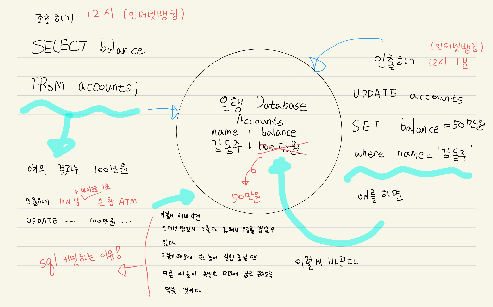
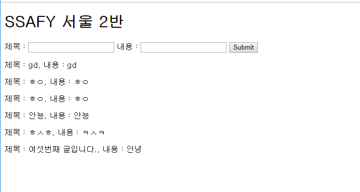

# Week9-Day4-2019-02-07

- 오전은 간단한 프로젝트, 오후엔 내일 프로젝트를 위한 간단한 프로젝트
- 저번 주에 했던 게시판 만들기를 복습해보자

## 게시판 만들기

- flask 설치를 하자

> workspace

```python
$ sudo pip3 install flask
```

- 그 다음엔 app.py와 index.html을 생성하자

> app.py

```python
from flask import Flask, render_template

app=Flask(__name__)

@app.route('/')
def index():
    return render_template('index.html')
```

> index.html

```html
<!DOCTYPE html>
<html lang="en">
<head>
    <meta charset="UTF-8">
    <meta name="viewport" content="width=device-width, initial-scale=1.0">
    <meta http-equiv="X-UA-Compatible" content="ie=edge">
    <title>SSAFY 서울 2반 게시판</title>
</head>
<body>
    <h1>SSAFY 서울 2반</h1>
    <form action = '/create'>
        제목 : <input type='text' name='title'/> <!--제목-->
        내용 : <input type='text' name='content'/> <!--내용-->
        <input type='submit' value='Submit'/>
    </form>
</body>
</html>
```

- create로 보냈으니까 `app.py`에서 `/create`를 만들자

> app.py

```python
from flask import Flask, render_template, request
...
...
@app.route('/create')
def create():
    """index 페이지에서 보낸 정보를 받아, DB에 저장한다."""
    title = request.args.get('title') #유저가 요청을 보낸 정보들이 담겨있다. (html 정보를 가져오는 것이다)
    #.args를 하면 Dictionary를 가져오는데 키 값으로 부를 수 있는데, 키 값이 없으면 에러가 뜨는데
    #.get을 쓰면 에러를 부르지 않는다.
    content = request.args.get('content')
    #sqlite3를 활용하여, 제목과 내용을 DB에 저장한다. 파이썬에서 import해서 사용이 가능하다.
    
    db = sqlite3.connect('board.db') #sqlite3 파일을 열기 위한 문장 #괄호 안에는 경로를 적어 준 것
#파일을 불러오고 db에 담아서 사용을 할 것이다.

    # 1. 커서를 생성
    c=db.cursor() #sql 문장을 쓸 수 있도록 커서를 만들었다.
    # 2. sql 실행
    sql = "INSERT INTO articles (title, content) VALUES ('{}','{}')".format(title, content)
    c.execute(sql) #sql 문장을 실행할 수 있는 execute 메소드 사용
    # 얘를 commit을 해야한다. (git과 비슷함 add 했다고 파일이 git에 올라가진 않음)
    # 3. commit
    db.commit()
    
    return '성공적으로 글이 작성되었습니다.'
```

- 위에서 굳이 sql을 다시 commit을 하는 이유가 무엇일까?
  - 참고로 지금 내가 사용하는 SELECT, 혹은 UPDATE 문장은 워낙 간단하기에 충돌될 일이 없지만, 앞서 예를 든 KT 같은 경우엔 일주일 동안 코드가 실행되기 때문에 그 일주일간은 남들이 들어와서 수정을 해선 안된다. 그러니까 이런 커밋이 필요한 것이다.



- 정보들을 저장 할 `board.db` 파일을 만들자.

> workspace

```
$ sqlite3 board.db
sqlite> CREATE TABLE articles(
   ...> id INTEGER PRIMARY KEY AUTOINCREMENT,
   ...> title TEXT,
   ...> content TEXT
   ...> );
```

- db에 저장된 모든 글들을 보여줘보자. 초기화면에서

> app.py

```python
from flask import Flask, render_template, request
import sqlite3
...
...
@app.route('/')
def index():
    """DB에 저장된 모든 글들을 보여준다."""
    # 1. 디비에 접속하여
    # 2. 저장된 모든 글들을 가져온다. (fetchall())
    # 3. index.html에 넣어서 보여준다.
    db=sqlite3.connect('board.db')
    c=db.cursor()
    sql="SELECT * FROM articles"
    c.execute(sql)
    articles=c.fetchall() #sql 문을 돌렸을 때 실행되는 결과물을 가져오는 것이다. #기본적으로 list를 리턴한다.
    # db.commit() 읽는 것은 db에 건들 필요가 없으니 얘는 필요없는 문장이다.
    return render_template('index.html',articles=articles)
```

- 받아온 parameter를 inde.html에서 표현할 수 있도록 코드를 짜면?

> index.html

```html
<!DOCTYPE html>
<html lang="en">
<head>
    <meta charset="UTF-8">
    <meta name="viewport" content="width=device-width, initial-scale=1.0">
    <meta http-equiv="X-UA-Compatible" content="ie=edge">
    <title>SSAFY 서울 2반 게시판</title>
</head>
<body>
    <h1>SSAFY 서울 2반</h1>
    <form action = '/create'>
        제목 : <input type='text' name='title'/> <!--제목-->
        내용 : <input type='text' name='content'/> <!--내용-->
        <input type='submit' value='Submit'/>
    </form>
    
        <p>제목 : {{i[1]}}, 내용 : {{i[2]}}</p> <!--<a>태그로 쓰면은 한 줄로 나오니 <p>태그로 써야 한 블럭씩 나온다-->
    
</body>
</html>
```



- 원하는 데이터를 삭제하는 법을 알아보자

> index.html

```html
<!DOCTYPE html>
<html lang="en">
<head>
    <meta charset="UTF-8">
    <meta name="viewport" content="width=device-width, initial-scale=1.0">
    <meta http-equiv="X-UA-Compatible" content="ie=edge">
    <title>SSAFY 서울 2반 게시판</title>
</head>
<body>
    <h1>SSAFY 서울 2반</h1>
    <form action = '/create'>
        제목 : <input type='text' name='title'/> <!--제목-->
        내용 : <input type='text' name='content'/> <!--내용-->
        <input type='submit' value='Submit'/>
    </form>
    
        <p>
            제목 : {{i[1]}}, 내용 : {{i[2]}}
            <a href="/delete/{{i[0]}}">[삭제]</a>
            <!-- 해당하는 글만 삭제해야한다. 따라서 DELETE FROM tables WHERE 'id' 가 되어야한다.-->
            <!--그래서 주소값에 id 값을 알려줘야한다.-->
            <a href="/edit/{{i[0]}}">[수정]</a>
            <!--얘도 마찬가지로 id값을 기준으로 삼는다-->
        </p>
    
</body>
</html>
```

> app.py

```python
from flask import Flask, render_template, request, redirect
...
...
@app.route("/delete/<int:article_id>") #<article_id>에다가 html에서 보낸 값을 받도록 해놓자
                                       #<> 얘는 variable 변수를 받을 수 있게 해주는 애
def delete(article_id): #위에 <int:article_id>를 쓰기 위해서 인자로 넣어줘야한다.
    """article_id에 저장된 id 값을 가진 레코드를 지운다."""
    db = sqlite3.connect('board.db')
    c=db.cursor()
    sql = "DELETE FROM articles WHERE ID = {}".format(article_id)
    c.execute(sql)
    db.commit() #얘는 db를 직접 조작하는 친구니까 커밋 해줘야한다. #조회 빼곤 전부 커밋해줘야한다.
    return redirect('/')#이 문장을 실행하면 다시 index 페이지로 돌아가도록 redirect를 써줬다. 그리고 얘는 import 해서 써야하는 애다.
```

- create 페이지도 귀찮으니까 `redirect`로 수정하자. (return 값만 바꿨음)

> app.py

```python
@app.route('/create')
def create():
    """index 페이지에서 보낸 정보를 받아, DB에 저장한다."""
    title = request.args.get('title')
    content = request.args.get('content')
    
    db = sqlite3.connect('board.db')
    c=db.cursor()
    sql = "INSERT INTO articles (title, content) VALUES ('{}','{}')".format(title, content)
    c.execute(sql)
    db.commit()
    
    return redirect('/') #얘만 바꿈
```

- 수정하기는 어떻게 할까? 조금 까다롭다. 첫 번째론 수정을 눌렀을 때 내가 썼던 글이 그대로 로드가 되어야한다. 그 다음은 form에 불러온 글을 넣는다.

> app.py

```python
@app.route("/edit/<int:article_id>")
def edit(article_id):
    """글을 편집할 수 있는 페이지를 보여준다."""
    # 1. 편집하고자 하는 글을 불러온다.
    # 2. form에 불러온 글을 넣는다.
    db=sqlite3.connect('board.db')
    c=db.cursor()
    sql="SELECT * FROM articles WHERE id = {}".format(article_id) #이러면 편집할 하나의 친구를 가져온다.
    c.execute(sql)
    article=c.fetchone() #읽는 거니까 커밋이 필요없다. #fecthall을 하면 리스트를 가져오니까 fecthone을 할 것이다.
                         #어차피 id는 하나니까
    return render_template('edit.html',article=article)
```

> edit.html

```html
<!DOCTYPE html>
<html lang="en">
<head>
    <meta charset="UTF-8">
    <meta name="viewport" content="width=device-width, initial-scale=1.0">
    <meta http-equiv="X-UA-Compatible" content="ie=edge">
    <title>SSAFY 서울 2반 게시판</title>
</head>
<body>
    <h1>SSAFY 서울 2반</h1>
    <form action = '/update/{{article[0]}}'> <!--create로 넘기면은 글이 추가되니까 /update를 새로 만들어보자-->
        제목 : <input type='text' name='title' placeholder = "안녕하세요" value="{{article[1]}}"/>
        <!--placeholder는 뭐냐면 안내문이구(내가 글을 쓰면 사라지는), value를 하면 내가 썼던 값이 나온다.-->
        내용 : <input type='text' name='content' placeholder = "안녕하세요" value="{{article[2]}}"/>
        <!--이렇게 수정하고 나서 그 원본을 교체 해야한다. app.py에서 다시 추가해줘야한다.-->
        <input type='submit' value='Submit'/>
    </form>
</body>
</html>
```

> app.py

```python
@app.route("/update/<int:article_id>")
def update(article_id):
    """edit페이지에서 보낸 내용을 실제 DB에 적용한다.(수정한다)"""
    db = sqlite3.connect('board.db')
    c=db.cursor()
    title = request.args.get('title') #수정 받은 파라미터를 가져오기 위해서 request를 사용했다.
    content = request.args.get('content') #수정 받은 파라미터를 가져오기 위해서 request를 사용했다.
    sql = "UPDATE articles SET title = '{}', content = '{}' WHERE ID = {}".format(title,content,article_id)
    c.execute(sql)
    db.commit()
    return redirect('/')
```


## 오후 : 앞서 배운 것으로 블로그를 만들어 보자

